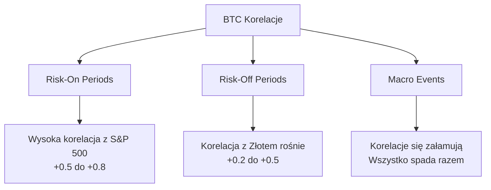
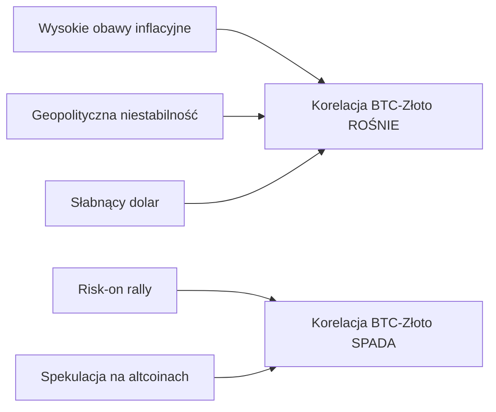
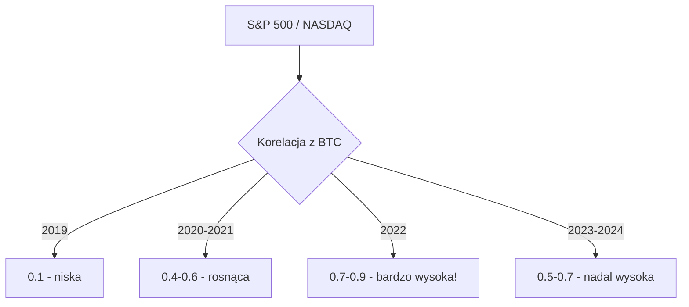
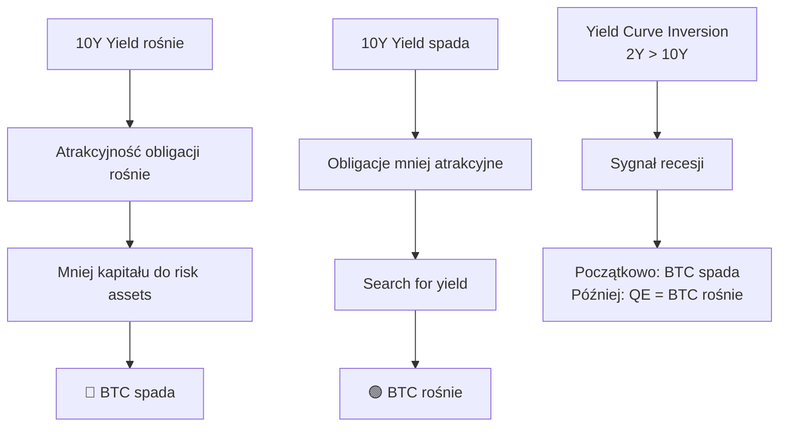
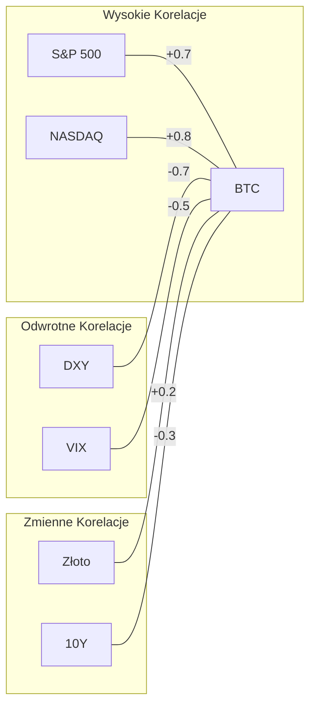

# 📈 Korelacje BTC z Innymi Aktywami

## Wprowadzenie dla Programisty

**Korelacja** to miara, jak dwa aktywa poruszają się względem siebie:
- **+1.0** = idealnie razem (oba rosną/spadają jednocześnie)
- **0.0** = brak związku
- **-1.0** = idealnie odwrotnie (jeden rośnie, drugi spada)

**Kluczowa obserwacja**: Korelacje BTC NIE są stałe - zmieniają się w czasie i zależą od warunków rynkowych!



---

## 1. Złoto (XAU/USD)

### Teoria: Digital Gold?

Bitcoin często nazywany "Digital Gold" ze względu na:
- **Ograniczoną podaż** (21M vs fizyczne zasoby złota)
- **Store of value** aspiracje
- **Hedge inflacyjny** (teoretycznie)

### Rzeczywistość: Korelacja zmienna

| Okres | Korelacja BTC-Złoto | Kontekst |
|-------|---------------------|----------|
| 2019 | +0.15 | Niska, różne narrative |
| 2020 Q1-Q2 | +0.40 | COVID, oba jako hedge |
| 2020 Q3-Q4 | -0.20 | BTC risk-on, złoto spada |
| 2021 | +0.05 | Minimalna |
| 2022 | +0.25 | Oba jako inflation hedge |
| 2023-2024 | +0.30 | Rosnąca korelacja |

### Diagram: Kiedy korelacja rośnie



### Badania

| Źródło | Wynik |
|--------|-------|
| JPMorgan (2021) | "Młodsi inwestorzy wybierają BTC zamiast złota" |
| Binance Research (2023) | Korelacja rośnie w okresach "flight to safety" |
| Academic: "Bitcoin as Digital Gold" (2022) | Korelacja statystycznie istotna tylko w crisis periods |

### Dla ML: Feature Engineering

```python
# Przykładowe features złoto
features = {
    'gold_return_1h': float,  # % zmiana złota w 1h
    'gold_return_24h': float,
    'btc_gold_ratio': float,  # BTC_price / Gold_price
    'btc_gold_ratio_change': float,  # zmiana ratio
    'gold_momentum': float,  # trend złota
}
```

### Ocena

| Kryterium | Ocena (1-5) | Uwagi |
|-----------|-------------|-------|
| Potencjał predykcyjny | ⭐⭐⭐ | Przydatny w określonych warunkach |
| Dla 1h predykcji | ⭐⭐⭐ | Przydatny gdy makro events |
| Dostępność | ⭐⭐⭐⭐⭐ | Yahoo, TradingView |

---

## 2. Ropa (WTI, Brent)

### Teoria

Ropa to wskaźnik:
- **Globalnej aktywności ekonomicznej**
- **Inflacji** (higher oil = higher CPI)
- **Geopolityki** (wojny, OPEC)

### Korelacja z BTC

| Typ korelacji | Mechanizm |
|---------------|-----------|
| **Bezpośrednia** | Oba jako "risk assets" rosną razem w boomie |
| **Pośrednia** | Ropa w górę → inflacja → Fed podwyżki → BTC spada |
| **Geopolityczna** | Szok naftowy → risk-off → BTC spada |

### Dane historyczne

| Wydarzenie | Ropa | BTC |
|------------|------|-----|
| 2020 COVID crash | -70% (ujemne ceny!) | -50% |
| 2021 Boom | +60% | +300% |
| 2022 Ukraine | +40% (spike) | -30% (initial) |

### Ocena

| Kryterium | Ocena (1-5) | Uwagi |
|-----------|-------------|-------|
| Potencjał predykcyjny | ⭐⭐ | Słaba bezpośrednia korelacja |
| Dla 1h predykcji | ⭐⭐ | Rzadko użyteczny |
| Dostępność | ⭐⭐⭐⭐⭐ | Yahoo Finance |

---

## 3. S&P 500 i NASDAQ

### Najważniejsza korelacja!

Od 2020 roku BTC zachowuje się jak **leveraged tech stock**:



### Dlaczego tak wysoka korelacja?

1. **Instytucje** - te same fundusze handlują obiema klasami aktywów
2. **Risk-on/off** - BTC traktowany jako tech exposure
3. **Fed policy** - oba reagują na stopy procentowe
4. **Algorithmic trading** - algos handlują correlations

### Dane empiryczne

| Okres | Korelacja BTC-SPX | R² |
|-------|-------------------|-----|
| 2017 | 0.05 | 0.00 |
| 2018 | 0.15 | 0.02 |
| 2019 | 0.10 | 0.01 |
| 2020 | 0.40 | 0.16 |
| 2021 | 0.55 | 0.30 |
| 2022 | 0.75 | 0.56 |
| 2023 | 0.60 | 0.36 |

### Badania

| Źródło | Wynik |
|--------|-------|
| Arcane Research (2022) | "BTC behaves like 3x leveraged NASDAQ" |
| Goldman Sachs (2022) | "Crypto correlation with equities at all-time high" |
| Academic (2023) | "Institutional adoption increased cross-asset correlation" |

### Feature Engineering

```python
# S&P 500 / NASDAQ features
features = {
    'spx_return_1h': float,
    'spx_return_4h': float,
    'nasdaq_return_1h': float,
    
    # Correlation rolling
    'btc_spx_corr_24h': float,  # rolling correlation
    'btc_spx_corr_7d': float,
    
    # Relative strength
    'btc_vs_spx_7d': float,  # BTC performance vs SPX
    
    # Market state
    'spx_above_200ma': 0/1,
    'is_us_market_open': 0/1,
}
```

### Ocena

| Kryterium | Ocena (1-5) | Uwagi |
|-----------|-------------|-------|
| Potencjał predykcyjny | ⭐⭐⭐⭐⭐ | **BARDZO WYSOKI** |
| Dla 1h predykcji | ⭐⭐⭐⭐ | Szczególnie w US trading hours |
| Dostępność | ⭐⭐⭐⭐⭐ | Yahoo Finance, darmowe |

---

## 4. US Treasury Yields (10Y, 2Y)

### Teoria

**Yield** = odsetki od obligacji rządowych
- **Rosnące yields** = "bezpieczna" konkurencja dla ryzykownych aktywów
- **10Y-2Y spread** = wskaźnik recesji

### Mechanizm



### Dane historyczne

| Okres | 10Y Yield | BTC |
|-------|-----------|-----|
| 2020 | 0.5% → 1.0% | +300% |
| 2021 | 1.0% → 1.5% | +60% |
| 2022 | 1.5% → 4.0% | -65% |
| 2023 | 4.0% → 5.0% | +150% (mimo yield) |

### Obserwacja

Yield ≠ jedyny driver. W 2023 yields były wysokie, ale BTC rósł z powodu:
- ETF expectations
- Halving expectations
- Względnej siły krypto

### Ocena

| Kryterium | Ocena (1-5) | Uwagi |
|-----------|-------------|-------|
| Potencjał predykcyjny | ⭐⭐⭐⭐ | Dobry macro context |
| Dla 1h predykcji | ⭐⭐ | Za wolna zmienność |
| Dostępność | ⭐⭐⭐⭐⭐ | FRED, Yahoo |

---

## 5. Podsumowanie Korelacji

### Tabela zbiorcza

| Aktywo | Typowa korelacja | Stabilność | Użyteczność 1h |
|--------|------------------|------------|----------------|
| **S&P 500** | +0.5 do +0.8 | Wysoka | ⭐⭐⭐⭐⭐ |
| **NASDAQ** | +0.6 do +0.9 | Wysoka | ⭐⭐⭐⭐⭐ |
| **DXY** | -0.6 do -0.8 | Wysoka | ⭐⭐⭐⭐ |
| **VIX** | -0.3 do -0.6 | Średnia | ⭐⭐⭐⭐ |
| **Złoto** | +0.1 do +0.4 | Niska | ⭐⭐⭐ |
| **10Y Yield** | -0.3 do -0.5 | Średnia | ⭐⭐ |
| **Ropa** | -0.1 do +0.3 | Bardzo niska | ⭐⭐ |

### Diagram: Correlation Matrix



---

## 6. Implementacja: Dynamic Correlation Features

### Kod przykładowy

```python
import pandas as pd
import numpy as np

def calculate_correlation_features(btc_prices, other_asset_prices, window=24):
    """
    Oblicz rolling correlation i inne cross-asset features.
    
    Args:
        btc_prices: Series z cenami BTC
        other_asset_prices: Series z cenami drugiego aktywa
        window: okno dla rolling calculations (godziny)
    
    Returns:
        DataFrame z features
    """
    # Returns
    btc_returns = btc_prices.pct_change()
    other_returns = other_asset_prices.pct_change()
    
    features = pd.DataFrame(index=btc_prices.index)
    
    # Rolling correlation
    features['rolling_corr'] = btc_returns.rolling(window).corr(other_returns)
    
    # Correlation change (momentum)
    features['corr_change'] = features['rolling_corr'].diff()
    
    # Relative performance
    features['relative_perf_24h'] = (
        btc_prices.pct_change(24) - other_asset_prices.pct_change(24)
    )
    
    # Lead-lag relationship
    # Czy other_asset przewiduje BTC?
    features['other_lagged_1h'] = other_returns.shift(1)
    features['other_lagged_4h'] = other_returns.shift(4)
    
    # Correlation regime
    features['high_corr_regime'] = (features['rolling_corr'] > 0.6).astype(int)
    
    return features
```

---

## 7. Rekomendacje dla ML Pipeline

### Must-have (Priorytet 1)

| Feature | Źródło | Update freq |
|---------|--------|-------------|
| SPX returns | Yahoo | 1min (trading hours) |
| NASDAQ returns | Yahoo | 1min (trading hours) |
| DXY | Yahoo | 1min |
| VIX | Yahoo | 1min (trading hours) |

### Nice-to-have (Priorytet 2)

| Feature | Źródło | Update freq |
|---------|--------|-------------|
| BTC-SPX correlation | Calculated | Hourly |
| Gold returns | Yahoo | 1min |
| 10Y Yield | Yahoo/FRED | Daily/Hourly |

### Uwagi implementacyjne

1. **US Market Hours** (14:30-21:00 UTC):
   - Korelacje są SILNIEJSZE w tych godzinach
   - Feature: `is_us_market_open`

2. **Weekendy**:
   - Tradycyjne rynki zamknięte
   - BTC może się "odłączać" od korelacji
   - Feature: `is_weekend`, `hours_since_market_close`

3. **Correlation regime switching**:
   - Model powinien wykrywać, kiedy korelacje się zmieniają
   - Rozważ osobne modele dla różnych reżimów

---

*Dokument stworzony: 2025-12-24 | Autor: Claude Opus 4.5*

