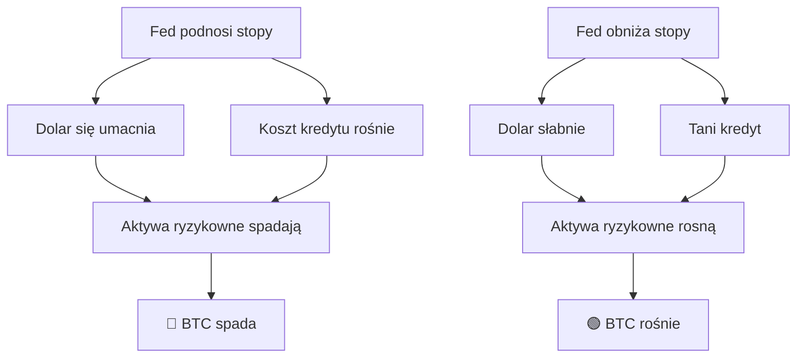
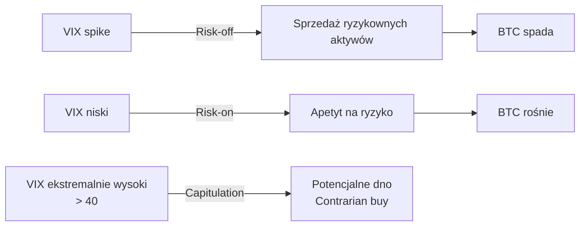
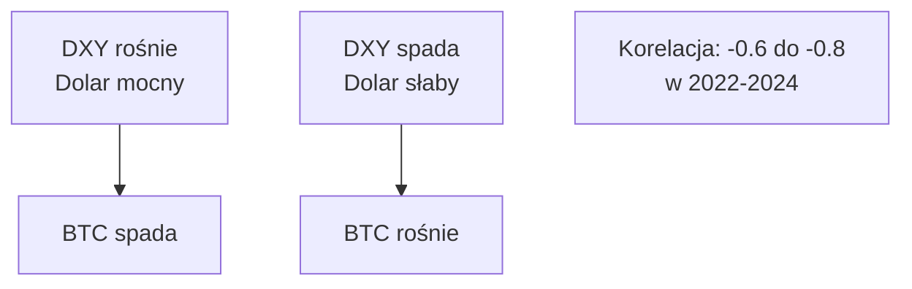
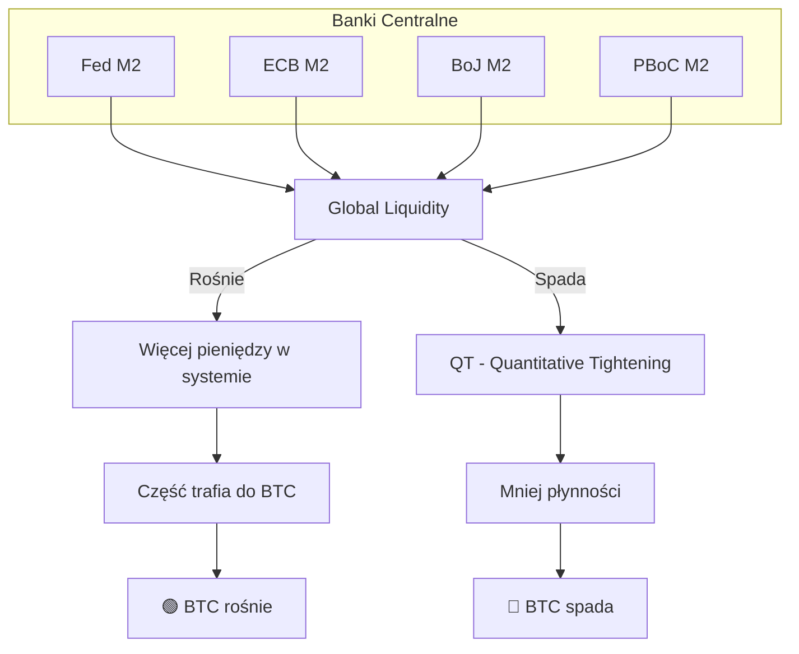
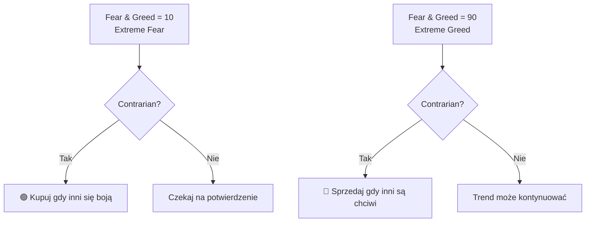

# 🌍 Dane Makroekonomiczne dla Predykcji BTC

## Wprowadzenie dla Programisty

**Dane makroekonomiczne** to wskaźniki opisujące stan globalnej gospodarki. Bitcoin, choć zdecentralizowany, coraz bardziej koreluje z tradycyjnymi rynkami - szczególnie od 2020 roku, gdy instytucje zaczęły inwestować.

**Kluczowe pytanie**: Czy Bitcoin to "risk-on asset" (rośnie gdy ryzykowne aktywa rosną) czy "digital gold" (bezpieczna przystań)?

**Odpowiedź 2024**: Bitcoin zachowuje się głównie jak **risk-on asset** w krótkim terminie, ale ma cechy "store of value" w długim terminie.

---

## 1. Stopy Procentowe (Interest Rates)

### Federal Reserve (Fed) - najważniejszy

**Fed Funds Rate** to główna stopa procentowa USA, która wpływa na CAŁY świat.

### Mechanizm wpływu na BTC



### Dane historyczne

| Okres | Akcja Fed | Efekt na BTC |
|-------|-----------|--------------|
| 2020-2021 | QE + niskie stopy | +1000% BTC |
| 2022 | Agresywne podwyżki | -77% BTC |
| 2023-2024 | Pivot expectations | Rally przy każdej sugestii obniżek |

### Wskaźniki do monitorowania

| Wskaźnik | Częstotliwość | Źródło | Wpływ na BTC |
|----------|---------------|--------|--------------|
| Fed Funds Rate | 8x/rok (FOMC) | federalreserve.gov | Bezpośredni |
| Fed Dot Plot | 4x/rok | federalreserve.gov | Expectations |
| CME FedWatch | Real-time | cmegroup.com | Market expectations |
| 2Y Treasury Yield | Ciągły | Treasury.gov | Leading indicator |

### Ocena dla ML

| Kryterium | Ocena (1-5) | Uwagi |
|-----------|-------------|-------|
| Potencjał predykcyjny | ⭐⭐⭐⭐ | Silny wpływ, ale rzadkie zmiany |
| Dla 1h predykcji | ⭐⭐⭐ | Głównie w dniach FOMC! |
| Dostępność | ⭐⭐⭐⭐⭐ | Darmowe, publiczne |
| Lead time | ⭐⭐ | Znane z wyprzedzeniem (kalendarz) |

---

## 2. VIX - Indeks Strachu

### Co to jest?

**VIX (CBOE Volatility Index)** mierzy oczekiwaną zmienność S&P 500 przez następne 30 dni. Nazywany "Fear Index".

```
VIX wysoki = rynek się boi = zazwyczaj spadki
VIX niski = complacency = rynek spokojny
```

### Korelacja z BTC



### Poziomy VIX

| VIX | Stan rynku | Implikacja dla BTC |
|-----|------------|-------------------|
| < 15 | Complacency | Neutralny/bullish |
| 15-20 | Normalny | Neutralny |
| 20-30 | Ostrożność | Możliwe spadki |
| 30-40 | Strach | Spadki lub capitulation |
| > 40 | Panika | Często lokalne dno (contrarian) |

### Badania

| Źródło | Wynik |
|--------|-------|
| "Crypto and VIX" (2023) | -0.45 korelacja BTC z VIX w okresach stresu |
| "Cross-asset correlations" (2022) | VIX spike > 30 poprzedza BTC spadki w 72% przypadków |

### API

```python
# Yahoo Finance (darmowe)
import yfinance as yf

vix = yf.Ticker("^VIX")
data = vix.history(period="1d", interval="1h")
```

### Ocena dla ML

| Kryterium | Ocena (1-5) | Uwagi |
|-----------|-------------|-------|
| Potencjał predykcyjny | ⭐⭐⭐⭐ | Dobry w okresach stresu |
| Dla 1h predykcji | ⭐⭐⭐⭐ | **TAK** - VIX spikes są real-time |
| Dostępność | ⭐⭐⭐⭐⭐ | Yahoo Finance, darmowe |
| Opóźnienie | ⭐⭐⭐⭐⭐ | Real-time (trading hours) |

---

## 3. DXY - Dollar Index

### Co to jest?

**DXY** mierzy siłę dolara względem koszyka 6 głównych walut (EUR, JPY, GBP, CAD, SEK, CHF).

### Odwrotna korelacja z BTC



### Dlaczego ta korelacja?

1. **BTC jest wyceniany w USD** - mocny dolar = BTC droższy dla reszty świata
2. **Risk-off sentiment** - mocny dolar = ucieczka do bezpieczeństwa
3. **Płynność globalna** - mocny dolar = mniejsza płynność emerging markets

### Dane historyczne

| Okres | DXY | BTC |
|-------|-----|-----|
| 2022 Q1-Q3 | +15% | -70% |
| 2022 Q4-2023 | -10% | +80% |
| 2024 H1 | Sideways | Volatile |

### Ocena dla ML

| Kryterium | Ocena (1-5) | Uwagi |
|-----------|-------------|-------|
| Potencjał predykcyjny | ⭐⭐⭐⭐⭐ | Bardzo silna odwrotna korelacja |
| Dla 1h predykcji | ⭐⭐⭐ | Wolniejsza zmienność niż BTC |
| Dostępność | ⭐⭐⭐⭐⭐ | Yahoo, TradingView, darmowe |

---

## 4. Globalna Płynność (M2)

### Co to jest?

**M2** to miara podaży pieniądza obejmująca gotówkę, depozyty i łatwo zamienne aktywa.

**Global M2** = suma M2 wszystkich głównych banków centralnych (Fed, ECB, BoJ, PBoC, BoE)

### Teoria: BTC podąża za płynnością



### Badania

| Źródło | Wynik |
|--------|-------|
| Raoul Pal / Real Vision | BTC korelacja z Global M2: 0.85 (z 3-mies. opóźnieniem) |
| Lyn Alden Research (2021) | "BTC is liquidity sponge" - absorbuje nadmiar płynności |
| CrossBorder Capital | Global liquidity leading indicator dla risk assets |

### Problem: opóźnienie danych

- M2 publikowane **miesięcznie** z 2-3 tygodniowym opóźnieniem
- Przydatne dla długoterminowych trendów, mniej dla 1h predykcji

### Ocena dla ML

| Kryterium | Ocena (1-5) | Uwagi |
|-----------|-------------|-------|
| Potencjał predykcyjny | ⭐⭐⭐⭐⭐ | Najważniejszy długoterminowy driver |
| Dla 1h predykcji | ⭐ | Zbyt rzadkie aktualizacje |
| Dostępność | ⭐⭐⭐⭐ | FRED, ECB, BoJ - darmowe |

---

## 5. Fear & Greed Index (Crypto)

### Co to jest?

**Crypto Fear & Greed Index** (Alternative.me) to composite index mierzący sentyment rynku krypto.

### Składniki

| Składnik | Waga | Źródło |
|----------|------|--------|
| Volatility | 25% | Porównanie z 30/90d średnią |
| Market Momentum/Volume | 25% | Buying volume |
| Social Media | 15% | Twitter, Reddit mentions |
| Surveys | 15% | Ankiety |
| Dominance | 10% | BTC dominance vs alts |
| Trends | 10% | Google Trends |

### Interpretacja

| Wartość | Stan | Strategia |
|---------|------|-----------|
| 0-25 | Extreme Fear | Contrarian: rozważ kupno |
| 25-45 | Fear | Ostrożność, ale szukaj okazji |
| 45-55 | Neutral | Brak silnego sygnału |
| 55-75 | Greed | Ostrożność |
| 75-100 | Extreme Greed | Contrarian: rozważ sprzedaż |

### Diagram: Contrarian Strategy



### Ocena dla ML

| Kryterium | Ocena (1-5) | Uwagi |
|-----------|-------------|-------|
| Potencjał predykcyjny | ⭐⭐⭐⭐ | Dobry jako contrarian indicator |
| Dla 1h predykcji | ⭐⭐⭐ | Aktualizowany raz dziennie |
| Dostępność | ⭐⭐⭐⭐⭐ | alternative.me, darmowe API |

### API

```python
import requests

url = "https://api.alternative.me/fng/"
params = {"limit": 30, "format": "json"}
response = requests.get(url, params=params)
data = response.json()
```

---

## 6. Inne Ważne Wskaźniki Makro

### Tabela: Przegląd

| Wskaźnik | Częstotliwość | Wpływ na BTC | Priorytet |
|----------|---------------|--------------|-----------|
| **CPI (Inflacja)** | Miesięcznie | Wysoki w dniach publikacji | 🥇 |
| **NFP (Zatrudnienie)** | Miesięcznie | Wysoki w dniach publikacji | 🥈 |
| **GDP** | Kwartalnie | Średni | 🥉 |
| **PCE** | Miesięcznie | Średni (Fed preferuje) | ⭐⭐ |
| **ISM Manufacturing** | Miesięcznie | Średni | ⭐⭐ |

### Kalendarz ekonomiczny jako feature

**Kluczowa obserwacja**: BTC często ma zwiększoną zmienność w dniach ważnych publikacji.

```python
# Przykładowe features z kalendarza
features = {
    'is_fomc_day': 0/1,
    'is_cpi_day': 0/1,
    'is_nfp_day': 0/1,
    'hours_to_next_major_event': int,
    'is_trading_hours_us': 0/1,
}
```

---

## Podsumowanie: Ranking Makro dla 1h Predykcji

| Wskaźnik | Potencjał 1h | Dostępność | Priorytet |
|----------|--------------|------------|-----------|
| **VIX** | ⭐⭐⭐⭐ | ⭐⭐⭐⭐⭐ | 🥇 **WYSOKI** |
| **DXY** | ⭐⭐⭐ | ⭐⭐⭐⭐⭐ | 🥈 **WYSOKI** |
| **Fear & Greed** | ⭐⭐⭐ | ⭐⭐⭐⭐⭐ | 🥉 WYSOKI |
| **FOMC Days** | ⭐⭐⭐⭐ | ⭐⭐⭐⭐⭐ | ŚREDNI (kalendarz) |
| **CPI Days** | ⭐⭐⭐⭐ | ⭐⭐⭐⭐⭐ | ŚREDNI (kalendarz) |
| **Fed Funds Rate** | ⭐⭐ | ⭐⭐⭐⭐⭐ | NISKI (rzadkie zmiany) |
| **Global M2** | ⭐ | ⭐⭐⭐⭐ | NISKI (dla 1h) |

---

## API Sources

### Darmowe

| Źródło | Dane | URL |
|--------|------|-----|
| FRED | M2, stopy, CPI | fred.stlouisfed.org |
| Yahoo Finance | VIX, DXY | yfinance library |
| Alternative.me | Fear & Greed | api.alternative.me |
| Investing.com | Kalendarz ekonomiczny | investing.com/economic-calendar |

### Płatne

| Źródło | Dane | Cena |
|--------|------|------|
| Bloomberg | Wszystko | $$$$$ |
| Refinitiv | Wszystko | $$$$ |
| Quandl | Macro data | $-$$$ |

---

*Dokument stworzony: 2025-12-24 | Autor: Claude Opus 4.5*

