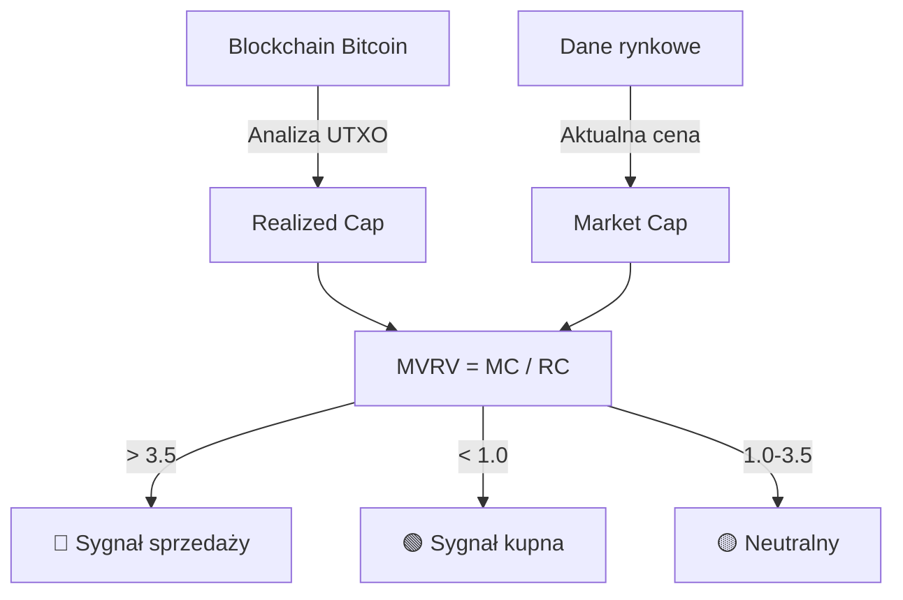
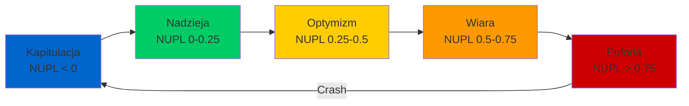
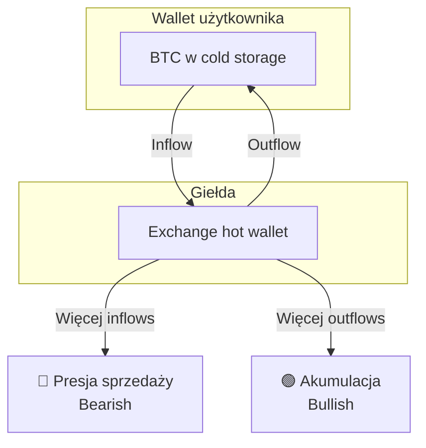
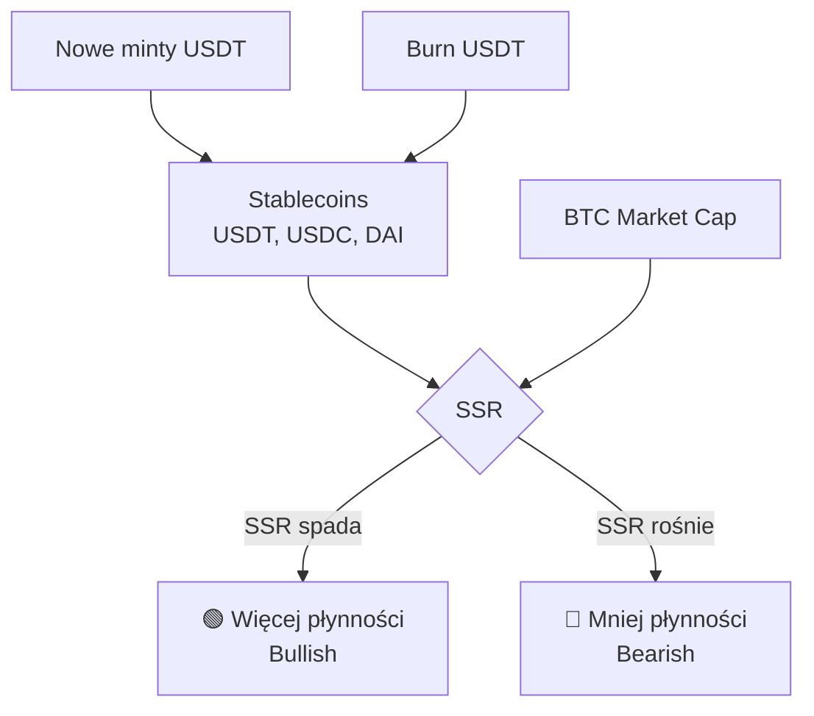
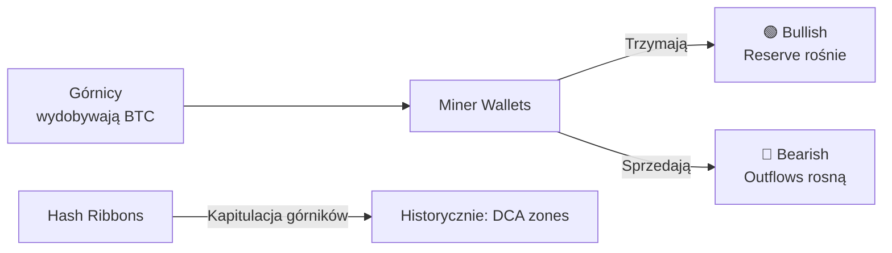

# 📊 Metryki On-Chain dla Predykcji BTC

## Wprowadzenie dla Programisty

**Metryki on-chain** to dane pobierane bezpośrednio z blockchaina Bitcoin. W przeciwieństwie do danych cenowych (które pokazują "co się stało"), dane on-chain pokazują **"kto robi co"** - czyli rzeczywiste zachowania uczestników sieci.

Wyobraź sobie to tak: cena to efekt końcowy, ale dane on-chain to "backstage" - widzisz jak górnicy, wieloryby (duzi inwestorzy) i giełdy przesuwają monety ZANIM cena się zmieni.

---

## 1. MVRV Ratio (Market Value to Realized Value)

### Co to jest? (dla laika)

**MVRV** porównuje aktualną wycenę rynkową Bitcoina z "realną" wartością - czyli średnią ceną, po której wszystkie monety zostały ostatnio przesunięte.

```
MVRV = Market Cap / Realized Cap

gdzie:
- Market Cap = aktualna cena × wszystkie BTC w obiegu
- Realized Cap = suma (każdy UTXO × cena w momencie ostatniego ruchu)
```

### Interpretacja

| Wartość MVRV | Interpretacja | Historyczne znaczenie |
|--------------|---------------|----------------------|
| **> 3.5** | Ekstremalne wykupienie | Szczyty cykli (2011, 2013, 2017, 2021) |
| **2.5 - 3.5** | Ostrożność zalecana | Późna faza hossy |
| **1.0 - 2.5** | Neutralne | Normalna zmienność |
| **< 1.0** | Wyprzedanie | Kapitulacja, potencjalne dno |

### Diagram: Jak MVRV działa



### Badania i dowody empiryczne

| Źródło | Rok | Wyniki |
|--------|-----|--------|
| Glassnode Research | 2020-2024 | MVRV > 3.5 poprzedził WSZYSTKIE szczyty cykliczne z 2-4 tygodniowym wyprzedzeniem |
| LookIntoBitcoin | 2019 | MVRV < 1 zidentyfikował dna cykli z dokładnością 90%+ |
| CryptoQuant | 2023 | MVRV w połączeniu z innymi metrykami zwiększa accuracy do 78% |

### Ocena dla ML

| Kryterium | Ocena (1-5) | Uwagi |
|-----------|-------------|-------|
| Potencjał predykcyjny | ⭐⭐⭐⭐⭐ | Najlepsza metryka dla długoterminowych szczytów/dołków |
| Dostępność danych | ⭐⭐⭐⭐ | Glassnode, CryptoQuant (płatne), LookIntoBitcoin (częściowo free) |
| Opóźnienie | ⭐⭐⭐ | ~1h do 1 dnia (zależne od źródła) |
| Koszt | ⭐⭐ | $49-$799/mies (Glassnode), $29-$99 (CryptoQuant) |
| Dla 1h predykcji | ⭐⭐ | Lepszy dla długoterminowych, ale zmiany momentum mogą być użyteczne |

### API Sources

```python
# Glassnode API
# https://docs.glassnode.com/
import requests

API_KEY = "your_api_key"
url = "https://api.glassnode.com/v1/metrics/market/mvrv"
params = {
    "a": "BTC",
    "api_key": API_KEY,
    "i": "1h"  # 1h, 24h, lub inne
}
response = requests.get(url, params=params)
```

---

## 2. NUPL (Net Unrealized Profit/Loss)

### Co to jest? (dla laika)

**NUPL** mierzy, ile niezrealizowanego zysku lub straty trzymają posiadacze Bitcoin. Jeśli wszyscy są "w zysku" - często oznacza to, że rynek jest gotowy do korekty (wszyscy chcą realizować zyski).

```
NUPL = (Market Cap - Realized Cap) / Market Cap
     = 1 - (1 / MVRV)
```

### Interpretacja - Strefy emocjonalne

| Wartość NUPL | Strefa | Emocja rynku | Implikacja |
|--------------|--------|--------------|------------|
| **> 0.75** | 🔴 Euphoria | Euforia, FOMO | Sprzedawaj |
| **0.5 - 0.75** | 🟠 Belief | Wiara, optymizm | Ostrożność |
| **0.25 - 0.5** | 🟡 Optimism | Optymizm | Trzymaj/akumuluj |
| **0 - 0.25** | 🟢 Hope | Nadzieja | Kupuj |
| **< 0** | 🔵 Capitulation | Kapitulacja | Silny sygnał kupna |

### Diagram: NUPL w cyklu rynkowym



### Badania

| Badanie | Wynik |
|---------|-------|
| Glassnode "The Week On-Chain" (2021) | NUPL > 0.75 poprzedził szczyt z kwietnia 2021 o 2 tygodnie |
| Academic: "On-chain Analytics for Crypto Trading" (2023) | NUPL + MVRV kombinacja - Sharpe ratio 2.3 vs 1.1 tylko cena |

### Ocena dla ML

| Kryterium | Ocena (1-5) | Uwagi |
|-----------|-------------|-------|
| Potencjał predykcyjny | ⭐⭐⭐⭐⭐ | Ekstremalnie skuteczny dla cykli |
| Dla 1h predykcji | ⭐⭐ | Wolna zmienność, lepszy jako feature długoterminowy |

---

## 3. Exchange Net Flows

### Co to jest? (dla laika)

**Exchange Net Flows** = różnica między BTC wpływającymi na giełdy a wypływającymi.

- **Pozytywny netflow** (więcej wpływa) → ludzie chcą sprzedać → bearish
- **Negatywny netflow** (więcej wypływa) → ludzie zabierają do cold storage → bullish

```
Net Flow = Inflow - Outflow
```

### Diagram: Logika Exchange Flows



### Dane historyczne

| Wydarzenie | Exchange Flow | Wynik |
|------------|---------------|-------|
| Marzec 2020 (COVID crash) | Massive inflows przed crashem | -50% w 2 dni |
| Listopad 2020 | Sustained outflows 3 mies. | +300% w 5 mies. |
| Maj 2021 (China ban) | Spike inflows | -55% w następnych 2 mies. |

### Ocena dla ML

| Kryterium | Ocena (1-5) | Uwagi |
|-----------|-------------|-------|
| Potencjał predykcyjny | ⭐⭐⭐⭐ | Dobry leading indicator dla większych ruchów |
| Dostępność | ⭐⭐⭐⭐ | CryptoQuant, Glassnode, Santiment |
| Dla 1h predykcji | ⭐⭐⭐ | Użyteczny - nagłe spikes sygnalizują ruchy |
| Opóźnienie | ⭐⭐⭐⭐ | ~10min do 1h (zależne od potwierdzenia transakcji) |

---

## 4. Stablecoin Supply Ratio (SSR)

### Co to jest? (dla laika)

**SSR** mierzy "siłę nabywczą" stablecoinów względem Bitcoina. Im więcej stablecoinów w obiegu, tym więcej "gotówki" czeka na zakup BTC.

```
SSR = Market Cap BTC / Market Cap wszystkich stablecoinów
```

### Interpretacja

| SSR | Interpretacja |
|-----|---------------|
| **Niski SSR** | Dużo stablecoinów "czeka" → potencjał wzrostowy |
| **Wysoki SSR** | Mało stablecoinów → ograniczona siła nabywcza |
| **Spadający SSR** | Rosnąca płynność → bullish |

### Diagram: SSR Flow



### Badania

| Źródło | Wynik |
|--------|-------|
| CryptoQuant Research (2022) | SSR < 2 historycznie poprzedzał duże rally |
| Tether mints correlation | 85% korelacja między USDT mints a wzrostami BTC w 14 dni |

### Ocena dla ML

| Kryterium | Ocena (1-5) | Uwagi |
|-----------|-------------|-------|
| Potencjał predykcyjny | ⭐⭐⭐⭐ | Dobry dla średnioterminowych trendów |
| Dla 1h predykcji | ⭐⭐ | Za wolna zmienność |

---

## 5. Miner Metrics

### Hashrate i Miner Revenue

Górnicy to "producenci" BTC. Ich zachowanie jest predykcyjne:
- **Rosnący hashrate** → zaufanie górników → bullish długoterminowo
- **Miner selling** → presja na cenę → krótkoterminowo bearish

### Miner Reserve i Outflows



### Hash Ribbons - sygnał kapitulacji

**Hash Ribbons** to indicator Charlesa Edwardsa pokazujący, kiedy górnicy kapitulują (wyłączają koparki z powodu strat).

| Sygnał | Interpretacja |
|--------|---------------|
| 30d MA hashrate < 60d MA | Kapitulacja górników |
| 30d MA > 60d MA (po kapitulacji) | Recovery = silny sygnał kupna |

### Badania

| Źródło | Wynik |
|--------|-------|
| Charles Edwards (2019) | Hash Ribbons buy signals: średni zwrot +200% w 12 mies. |
| Cambridge Bitcoin Index | Hashrate jako leading indicator dla ceny: 0.7 korelacja z 3-mies. opóźnieniem |

### Ocena dla ML

| Kryterium | Ocena (1-5) | Uwagi |
|-----------|-------------|-------|
| Potencjał predykcyjny | ⭐⭐⭐ | Dobry dla długoterminowych, słabszy dla 1h |
| Dostępność | ⭐⭐⭐⭐⭐ | blockchain.com, Glassnode - często darmowe |
| Dla 1h predykcji | ⭐ | Zbyt wolna zmienność |

---

## 6. Whale Wallet Movements

### Co to jest?

Śledzenie dużych portfeli (>1000 BTC) i ich ruchów.

### Kategorie

| Kategoria | BTC | Znaczenie |
|-----------|-----|-----------|
| Shrimp | < 1 | Retail |
| Crab | 1-10 | Small investors |
| Fish | 10-100 | Affluent investors |
| Shark | 100-1000 | High net worth |
| Whale | 1000-10000 | Institutional/Wealthy |
| Humpback | > 10000 | Mega institutions |

### Whale Alert jako sygnał

Duże transfery (np. > 1000 BTC) często poprzedzają ruchy rynkowe:
- **Whale → Exchange** = potencjalna sprzedaż
- **Exchange → Unknown wallet** = potencjalna akumulacja

### Ocena dla ML

| Kryterium | Ocena (1-5) | Uwagi |
|-----------|-------------|-------|
| Potencjał predykcyjny | ⭐⭐⭐⭐ | Dobry leading indicator |
| Dostępność | ⭐⭐⭐⭐ | Whale Alert (free Twitter), płatne API |
| Dla 1h predykcji | ⭐⭐⭐⭐ | Dobry! Duże transfery mogą poprzedzać ruchy |
| Opóźnienie | ⭐⭐⭐⭐⭐ | Real-time (mempool monitoring) |

---

## Podsumowanie: Ranking On-Chain dla 1h Predykcji

| Metryka | Potencjał 1h | Dostępność | Priorytet implementacji |
|---------|--------------|------------|------------------------|
| Whale Movements | ⭐⭐⭐⭐ | ⭐⭐⭐⭐ | 🥇 **WYSOKI** |
| Exchange Net Flows | ⭐⭐⭐ | ⭐⭐⭐⭐ | 🥈 **WYSOKI** |
| Stablecoin Flows | ⭐⭐ | ⭐⭐⭐ | 🥉 ŚREDNI |
| MVRV (momentum) | ⭐⭐ | ⭐⭐⭐⭐ | ŚREDNI |
| NUPL (momentum) | ⭐⭐ | ⭐⭐⭐⭐ | ŚREDNI |
| Miner Metrics | ⭐ | ⭐⭐⭐⭐⭐ | NISKI (dla 1h) |

---

## API Sources - Implementacja

### Darmowe/Tanie

| Źródło | URL | Dane |
|--------|-----|------|
| blockchain.com | api.blockchain.info | Hashrate, difficulty |
| LookIntoBitcoin | lookintoBitcoin.com | MVRV, NUPL (historyczne) |
| Whale Alert | @whale_alert | Duże transfery |

### Płatne

| Źródło | Cena/mies | Dane |
|--------|-----------|------|
| Glassnode | $49-$799 | Wszystkie metryki, API |
| CryptoQuant | $29-$99 | Exchange flows, whale |
| Santiment | $49-$349 | Social + on-chain |
| IntoTheBlock | Custom | Institutional grade |

---

## Następne kroki

1. [ ] Zaimplementować scraper dla Whale Alert Twitter
2. [ ] Uzyskać trial Glassnode/CryptoQuant
3. [ ] Dodać tabele w bazie dla on-chain metrics
4. [ ] Utworzyć daemon do pobierania danych hourly

---

*Dokument stworzony: 2025-12-24 | Autor: Claude Opus 4.5*

