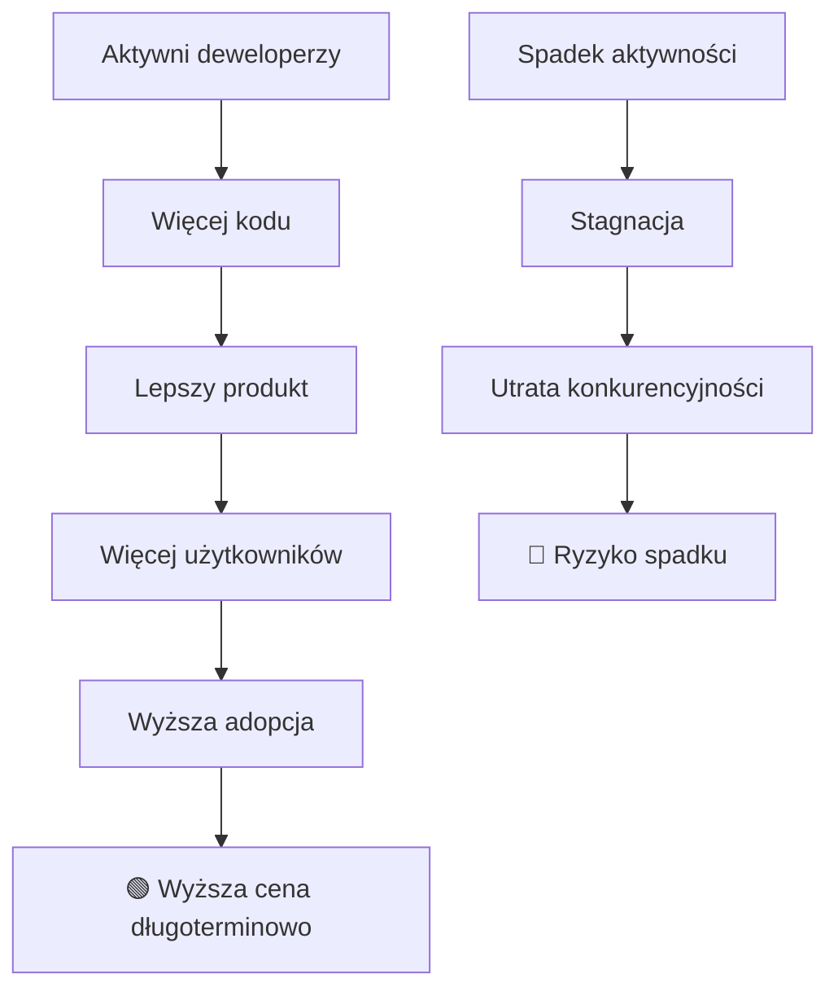
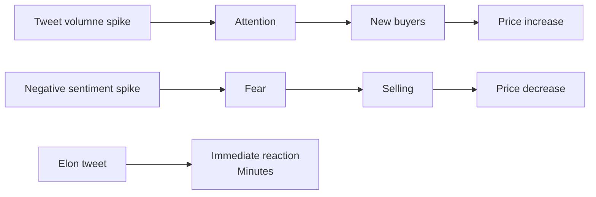
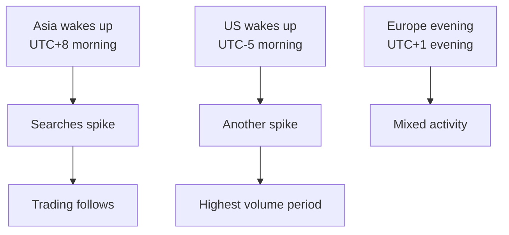
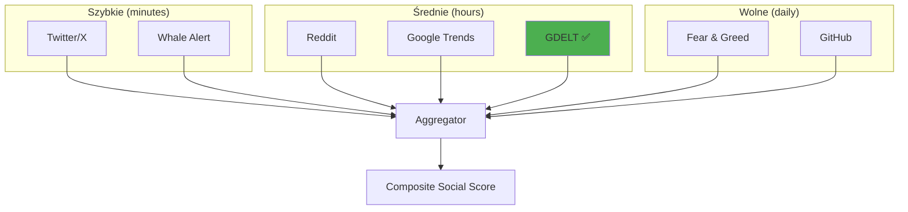

# 👨‍💻 Aktywność Deweloperów i Social Media

## Wprowadzenie

Ta kategoria obejmuje dane, które są na pograniczu finansów i technologii/społeczeństwa. Są to dane **testowane empirycznie**, ale nie tak "mainstream" jak VIX czy stopy procentowe.

---

## 1. Aktywność Deweloperów (GitHub Metrics)

### Teoria

**Hipoteza**: Zdrowy projekt = aktywny development = rosnąca wartość fundamentalna.



### Metryki

| Metryka | Opis | Interpretacja |
|---------|------|---------------|
| **Active contributors** | Deweloperzy z commitami w okresie | Więcej = zdrowszy projekt |
| **Commits/week** | Liczba commitów | Aktywność development |
| **Pull requests** | Otwarte/zamknięte PR | Współpraca community |
| **Issues** | Open/Closed ratio | Jakość zarządzania |
| **Stars growth** | Nowe gwiazdki | Zainteresowanie |
| **Forks** | Nowe forki | Adoption |

### Dane historyczne dla Bitcoin Core

| Rok | Contributors | Commits | Korelacja z ceną |
|-----|--------------|---------|------------------|
| 2017 | ~100 | 1200 | Boom |
| 2018 | ~120 | 1500 | Bear mimo development |
| 2020 | ~140 | 1800 | Bull run |
| 2023 | ~150 | 2000 | Recovery |

**Obserwacja**: Korelacja jest prawdopodobnie **długoterminowa** (miesiące/lata), ale warto zbadać czy momentum (nagłe zmiany) może być użyteczne dla krótszych horyzontów. Nie odrzucamy bez testów!

### Repozytoria do monitorowania

| Repo | Znaczenie |
|------|-----------|
| `bitcoin/bitcoin` | Core protocol |
| `lightning/lnd` | Lightning Network |
| `lightning/bolts` | Lightning specs |
| `bitcoinjs/bitcoinjs-lib` | JS library |
| `bitcoin/bips` | Improvement proposals |

### API

```python
import requests

# GitHub API
def get_repo_stats(owner, repo):
    headers = {"Authorization": f"token {GITHUB_TOKEN}"}
    
    # Commits this week
    commits_url = f"https://api.github.com/repos/{owner}/{repo}/stats/commit_activity"
    commits = requests.get(commits_url, headers=headers).json()
    
    # Contributors
    contribs_url = f"https://api.github.com/repos/{owner}/{repo}/contributors"
    contribs = requests.get(contribs_url, headers=headers).json()
    
    return {
        'weekly_commits': sum(week['total'] for week in commits[-4:]) / 4,
        'contributors': len(contribs),
    }
```

### Ocena

| Kryterium | Ocena (1-5) | Uwagi |
|-----------|-------------|-------|
| Potencjał predykcyjny | ⭐⭐⭐ | Długoterminowy fundamentalny indicator |
| Dla 1h predykcji | ⭐ | **NIE** - zbyt wolna zmienność |
| Dostępność | ⭐⭐⭐⭐⭐ | GitHub API (darmowe) |
| Badania | ⭐⭐⭐ | Niektóre academic papers potwierdzają |

---

## 2. Twitter/X Activity

### Teoria

Twitter/X to główna platforma komunikacji krypto community. Sentiment i volume tweetów mogą być leading indicators.

### Metryki

| Metryka | Opis | Użyteczność |
|---------|------|-------------|
| **Volume** | Liczba tweetów o BTC | Attention proxy |
| **Sentiment** | Pozytywne/negatywne | Mood indicator |
| **Influencer tweets** | @elonmusk, @saylor, etc. | High impact |
| **Hashtag trends** | #Bitcoin, #BTC | Trend strength |
| **Engagement** | Likes, RTs, replies | Reach |

### Badania

| Badanie | Rok | Wynik |
|---------|-----|-------|
| "Twitter Sentiment and BTC" | 2018 | 65% accuracy using sentiment |
| "Social Media and Crypto" | 2021 | Volume spike 2-4h przed price moves |
| "Elon Effect" | 2021 | Single tweet = 10%+ price move |

### Diagram: Twitter → Price



### Problem: Dostępność danych

Od 2023 Twitter API jest **bardzo drogi**:
- Basic: $100/mies (100 tweetów/mies)
- Pro: $5000/mies (1M tweetów/mies)

**Alternatywy**:
- Santiment (agregowane dane)
- LunarCrush
- TheTie
- Web scraping (ryzyko prawne)

### Ocena

| Kryterium | Ocena (1-5) | Uwagi |
|-----------|-------------|-------|
| Potencjał predykcyjny | ⭐⭐⭐⭐⭐ | Bardzo wysoki, udokumentowany |
| Dla 1h predykcji | ⭐⭐⭐⭐ | TAK - szczególnie influencer tweets |
| Dostępność | ⭐⭐ | Drogi po zmianach API 2023 |
| Koszt | ⭐ | $5000+/mies dla pełnych danych |

---

## 3. Reddit Activity

### Subreddity do monitorowania

| Subreddit | Members | Typ |
|-----------|---------|-----|
| r/Bitcoin | 5M+ | General BTC |
| r/CryptoCurrency | 7M+ | Ogólne krypto |
| r/BitcoinMarkets | 500K | Trading |
| r/CryptoMoonShots | 2M+ | Spekulacja (contrarian) |

### Metryki

| Metryka | Użyteczność |
|---------|-------------|
| Posts per day | Activity level |
| Comment sentiment | Mood |
| Upvote ratio | Agreement |
| "Buy" vs "Sell" mentions | Intent |
| Meme frequency | Euphoria indicator |

### Badania

| Badanie | Wynik |
|---------|-------|
| "Reddit and Crypto Prices" (2021) | Korelacja r/CryptoCurrency activity z 24h returns |
| WSB studies | r/wallstreetbets predicted GME (applicable?) |

### API

```python
import praw

reddit = praw.Reddit(
    client_id="YOUR_ID",
    client_secret="YOUR_SECRET",
    user_agent="trends-sniffer"
)

def get_reddit_metrics(subreddit_name, limit=100):
    subreddit = reddit.subreddit(subreddit_name)
    
    posts = list(subreddit.hot(limit=limit))
    
    return {
        'posts_count': len(posts),
        'avg_score': sum(p.score for p in posts) / len(posts),
        'avg_comments': sum(p.num_comments for p in posts) / len(posts),
        'upvote_ratio': sum(p.upvote_ratio for p in posts) / len(posts),
    }
```

### Ocena

| Kryterium | Ocena (1-5) | Uwagi |
|-----------|-------------|-------|
| Potencjał predykcyjny | ⭐⭐⭐ | Środnia |
| Dla 1h predykcji | ⭐⭐ | Wolniejsza dynamika niż Twitter |
| Dostępność | ⭐⭐⭐⭐ | API nadal relatywnie otwarte |
| Koszt | ⭐⭐⭐⭐ | Darmowe (rate limits) |

---

## 4. Google Trends (Rozszerzone)

### Już w projekcie!

trends-sniffer już zbiera dane Google Trends. Ale można rozszerzyć:

### Dodatkowe frazy

| Kategoria | Frazy | Interpretacja |
|-----------|-------|---------------|
| **FOMO** | "buy bitcoin now", "bitcoin to moon" | Euphoria |
| **FUD** | "bitcoin crash", "is bitcoin dead" | Fear |
| **Education** | "what is bitcoin", "how to buy btc" | New interest |
| **Technical** | "bitcoin halving", "lightning network" | Informed interest |

### Regional Patterns



### Feature Ideas

```python
def google_trends_features(trends_data):
    return {
        # Volume features
        'btc_search_volume': float,
        'btc_search_change_24h': float,
        'btc_search_zscore': float,  # vs historical
        
        # Regional
        'asia_vs_us_ratio': float,
        'europe_contribution': float,
        
        # Sentiment proxies
        'buy_vs_sell_ratio': float,  # "buy bitcoin" / "sell bitcoin"
        'fomo_index': float,  # euphoria phrases
        'fud_index': float,  # fear phrases
        
        # Behavioral
        'new_interest_index': float,  # educational searches
    }
```

### Ocena

| Kryterium | Ocena (1-5) | Uwagi |
|-----------|-------------|-------|
| Potencjał predykcyjny | ⭐⭐⭐⭐ | Dobrze udokumentowany |
| Dla 1h predykcji | ⭐⭐ | Google podaje hourly, ale opóźnione |
| Dostępność | ⭐⭐⭐⭐ | pytrends library |
| Już w projekcie | ✅ | Rozszerzyć frazy |

---

## 5. Fear & Greed vs Social Metrics

### Porównanie

| Metryka | Update | Latency | Granularity |
|---------|--------|---------|-------------|
| Fear & Greed | Daily | 24h | 1 value |
| Twitter | Real-time | Minutes | Per-tweet |
| Reddit | Hourly | Hours | Per-post |
| Google Trends | 4-8h | Hours | Hourly-ish |
| GDELT (już w projekcie) | Hourly | ~1h | Per-article |

### Diagram: Social Data Pipeline



---

## 6. Influencer Tracking

### Top Crypto Influencers (2024)

| Handle | Followers | Impact | Reliability |
|--------|-----------|--------|-------------|
| @elonmusk | 150M+ | 🔥🔥🔥🔥🔥 | ⚠️ Unpredictable |
| @slotor | 3.5M | 🔥🔥🔥🔥 | ⭐⭐⭐⭐ BTC maximalist |
| @APompliano | 1.5M | 🔥🔥🔥 | ⭐⭐⭐ Bullish bias |
| @caborek | 1.2M | 🔥🔥🔥 | ⭐⭐⭐ Analysis |
| @CathieDWood | 1M | 🔥🔥🔥 | ⭐⭐⭐⭐ Institutional |

### Elon Effect - Case Study

| Data | Tweet | Efekt na BTC |
|------|-------|--------------|
| 2021-01-29 | #Bitcoin bio | +20% w 24h |
| 2021-02-08 | Tesla $1.5B BTC | +15% |
| 2021-05-12 | Tesla stops BTC | -12% instant |
| 2021-06-03 | "💔" + BTC | -5% |

### Implementation Challenge

Monitorowanie influencerów w real-time wymaga:
1. Twitter API access (drogie)
2. Real-time processing
3. Sentiment analysis
4. Impact weighting

---

## 7. Discord/Telegram Activity

### Wydobycie danych

Te platformy są trudniejsze do monitorowania:
- Prywatne serwery
- Brak publicznego API
- Etyczne wątpliwości

### Agregatory

Niektóre firmy agregują te dane:
- **LunarCrush**: Social aggregator
- **Santiment**: Multiple sources
- **TheTie**: Institutional grade

### Ocena

| Kryterium | Ocena (1-5) | Uwagi |
|-----------|-------------|-------|
| Potencjał predykcyjny | ⭐⭐⭐⭐ | Wysoki - early signals |
| Dostępność | ⭐ | Bardzo trudne |
| Koszt | ⭐ | Bardzo wysokie (agregatory) |
| Warto? | 🤔 | Tylko przez agregatory |

---

## Podsumowanie: Ranking Social/Dev Data

| Źródło | Potencjał 1h | Dostępność | Koszt | Priorytet |
|--------|--------------|------------|-------|-----------|
| **GDELT** ✅ | ⭐⭐⭐⭐ | ⭐⭐⭐⭐⭐ | Free | 🥇 **W projekcie** |
| **Google Trends** ✅ | ⭐⭐⭐ | ⭐⭐⭐⭐ | Free | 🥈 **W projekcie** |
| **Twitter/X** | ⭐⭐⭐⭐⭐ | ⭐⭐ | $$$ | ⚠️ Kosztowne |
| **Fear & Greed** | ⭐⭐⭐ | ⭐⭐⭐⭐⭐ | Free | 🥉 Dodać |
| **Reddit** | ⭐⭐ | ⭐⭐⭐⭐ | Free | 🔬 Do zbadania |
| **GitHub** | 🔬 | ⭐⭐⭐⭐⭐ | Free | 🔬 Do zbadania (momentum?) |

---

## Rekomendacje

### Natychmiast (już mamy/łatwe):
1. ✅ GDELT - rozbudować query
2. ✅ Google Trends - więcej fraz
3. ➕ Fear & Greed Index - dodać (1 API call/day)

### W przyszłości (kosztowne):
4. 💰 Twitter/X - jeśli budżet pozwoli
5. 💰 Santiment/LunarCrush - agregowane social

### Do zbadania w późniejszych fazach:
6. 🔬 GitHub - prawdopodobnie długoterminowe, ale momentum warto przetestować
7. 🔬 Discord/Telegram - trudne technicznie, ale można przez agregatory

**Filozofia**: Nie odrzucamy hipotez bez empirycznej weryfikacji!

---

*Dokument stworzony: 2025-12-24 | Autor: Claude Opus 4.5*

