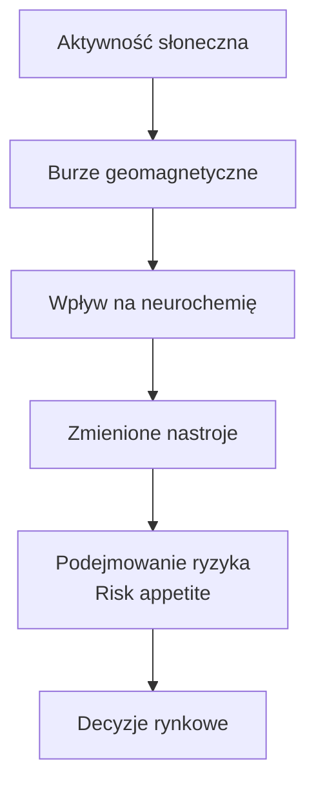
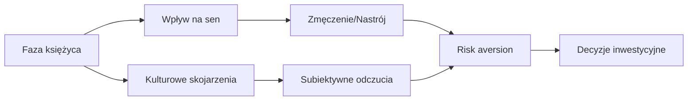
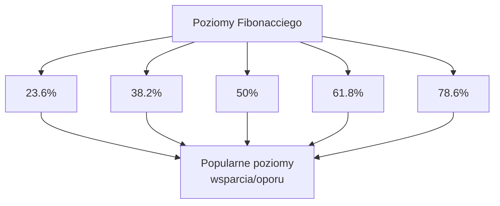

# 🔮 Ezoteryczne i Eksperymentalne Źródła Danych

## Wprowadzenie

Ten dokument opisuje niekonwencjonalne źródła danych, które mogą mieć wpływ na rynki finansowe. Niektóre z nich mają zaskakująco silne wsparcie empiryczne, inne są czysto spekulatywne. 

**Podejście naukowe**: Nawet jeśli coś brzmi "szalenie", warto testować. ML nie ma uprzedzeń - jeśli korelacja istnieje, model ją znajdzie.

---

## 1. Aktywność Słoneczna (Sunspots)

### Teoria

**Hipoteza**: Aktywność słoneczna wpływa na nastroje ludzi, a tym samym na ich decyzje finansowe.

**Mechanizm (teoretyczny)**:
- Burze słoneczne wpływają na pole magnetyczne Ziemi
- To może wpływać na melatoninę i serotonię
- Zmienione nastroje → zmienione decyzje inwestycyjne



### Badania naukowe

| Badanie | Rok | Wynik |
|---------|-----|-------|
| Krivelyova & Robotti | 2003 | Burze geomagnetyczne korelują z niższymi zwrotami (S&P 500) |
| Dowling & Lucey | 2008 | Potwierdzenie efektu geomagnetycznego na 37 rynkach |
| "Are Stock Markets Really Affected by Sunspots?" | 2010 | Mixed results - słaba, ale istotna korelacja |
| Zaremba et al. | 2020 | Meta-analysis: słaby, ale statystycznie istotny efekt |

### Dane

- **Źródło**: NOAA Space Weather (swpc.noaa.gov)
- **Metryki**: 
  - Sunspot number
  - Kp Index (aktywność geomagnetyczna)
  - Solar flare alerts

### Kod przykładowy

```python
import requests

# NOAA Space Weather API
url = "https://services.swpc.noaa.gov/products/noaa-planetary-k-index.json"
response = requests.get(url)
kp_data = response.json()

# Kp Index: 0-9 (wyższy = silniejsza burza)
# Kp >= 5 = burza geomagnetyczna
```

### Ocena

| Kryterium | Ocena (1-5) | Uwagi |
|-----------|-------------|-------|
| Potencjał predykcyjny | ⭐⭐ | Słaby, ale mierzalny |
| Testowane | ⭐⭐⭐⭐ | Tak, w peer-reviewed journals |
| Dostępność | ⭐⭐⭐⭐⭐ | Darmowe API (NOAA) |
| Dla 1h predykcji | ⭐ | Raczej długoterminowy |
| Warto testować? | ✅ | Tak, jako dodatkowy feature |

---

## 2. Cykle Lunarne (Moon Phases)

### Teoria

**Hipoteza**: Fazy księżyca wpływają na zachowania ludzi (termin "lunatic" pochodzi od "luna").

**Badania na rynkach**:

| Badanie | Rok | Wynik |
|---------|-----|-------|
| Yuan, Zheng, Zhu | 2006 | Stock returns wyższe przy nowym księżycu vs pełnia |
| Dichev & Janes | 2003 | 15-day return around new moon > full moon (48 krajów) |
| "Lunar Cycle Effects in Stock Returns" | 2001 | 3-5% różnica roczna między fazami |

### Mechanizm (hipotetyczny)



### Implementacja

```python
from datetime import datetime
import ephem

def get_moon_phase(date):
    """
    Zwraca fazę księżyca (0-1).
    0 = nów, 0.5 = pełnia
    """
    moon = ephem.Moon()
    moon.compute(date)
    return moon.phase / 100  # 0-100 → 0-1

def get_moon_features(date):
    phase = get_moon_phase(date)
    return {
        'moon_phase': phase,
        'is_new_moon': phase < 0.05,
        'is_full_moon': 0.45 < phase < 0.55,
        'days_to_new_moon': ...,  # można obliczyć
        'moon_cycle_position': phase,  # 0-1 cykl
    }
```

### Ocena

| Kryterium | Ocena (1-5) | Uwagi |
|-----------|-------------|-------|
| Potencjał predykcyjny | ⭐⭐ | Słaby, ale badania potwierdzają |
| Testowane | ⭐⭐⭐⭐ | Peer-reviewed journals |
| Dostępność | ⭐⭐⭐⭐⭐ | Łatwe do obliczenia |
| Dla 1h predykcji | ⭐ | Długoterminowy cykl |
| Warto testować? | ✅ | Tak, jako dodatkowy feature |

---

## 3. Astrologia Finansowa

### Teoria

Niektórzy traderzy używają pozycji planet do podejmowania decyzji. **W.D. Gann** (legendarny trader lat 1920s-1950s) podobno używał astrologii.

### Czy są badania?

| Źródło | Wynik |
|--------|-------|
| Peer-reviewed | **BRAK** potwierdzenia w naukowej literaturze |
| Praktitioners | Anegdotyczne "sukcesy" |
| Statistical analysis | Brak istotnej korelacji |

### Popularne "sygnały"

| Układ | Rzekomy wpływ |
|-------|---------------|
| Mercury Retrograde | Komunikacja, technologia - chaos |
| Saturn-Jupiter conjunction | Wielkie cykle ekonomiczne (20 lat) |
| Mars aspects | Agresja, konflikty |

### Ocena

| Kryterium | Ocena (1-5) | Uwagi |
|-----------|-------------|-------|
| Potencjał predykcyjny | ⭐ | Brak dowodów |
| Testowane naukowo | ⭐ | Brak peer-reviewed studies |
| Warto testować? | 🤔 | Można, ale prawdopodobnie strata czasu |

---

## 4. Teorie Numeryczne (Fibonacci, Gann, Elliott Wave)

### Fibonacci w tradingu

**Teoria**: Ciąg Fibonacciego (1,1,2,3,5,8,13...) i złoty podział (0.618) pojawiają się w naturze, więc też w rynkach.



### Badania

| Źródło | Wynik |
|--------|-------|
| "Do Fibonacci Numbers Have Predictive Value?" (2013) | Mixed results |
| Technical Analysis studies | Self-fulfilling prophecy - działają bo ludzie ich używają |
| ML studies | Jako features mogą poprawić modele o 1-3% |

### Gann Theory

**W.D. Gann** używał:
- Kątów geometrycznych (45°, 90°, 180°)
- Cykli czasowych (7, 30, 90, 360 dni)
- Numerologii

**Ocena**: Brak naukowego potwierdzenia, ale niektóre cykle czasowe mogą być użyteczne.

### Elliott Wave

Teoria, że rynki poruszają się w 5-falowych trendowych i 3-falowych korektach.

**Problem**: Bardzo subiektywna interpretacja - każdy analizuje inaczej.

### Ocena

| Kryterium | Fibonacci | Gann | Elliott |
|-----------|-----------|------|---------|
| Potencjał | ⭐⭐⭐ | ⭐⭐ | ⭐⭐ |
| Testowane | ⭐⭐⭐ | ⭐⭐ | ⭐⭐ |
| Dla ML | ⭐⭐⭐ | ⭐ | ⭐ |
| Warto testować? | ✅ | 🤔 | ❌ (zbyt subiektywne) |

---

## 5. Butterfly Effect / Chaos Theory

### Teoria

**Butterfly Effect**: Małe zmiany w warunkach początkowych mogą prowadzić do dramatycznie różnych wyników.

**Implikacja dla ML**: Rynki są chaotyczne - predykcja długoterminowa jest z natury niemożliwa.

### Praktyczne zastosowanie

```mermaid
graph TD
    A[Chaos Theory insights] --> B[Krótki horyzont predykcji<br/>1h jest rozsądny]
    A --> C[Ensemble methods<br/>wiele modeli]
    A --> D[Confidence intervals<br/>nie tylko punkt estimate]
    A --> E[Regime detection<br/>różne "stany" rynku]
```

### Badania

| Źródło | Wynik |
|--------|-------|
| "Is the Stock Market Chaotic?" (1991) | Evidence for low-dimensional chaos |
| Mandelbrot "The (Mis)Behavior of Markets" (2004) | Rynki nie są gaussian, fat tails |
| ML studies | Chaotyczność ogranicza accuracy do ~55-60% dla krótkich okresów |

### Ocena

| Kryterium | Ocena (1-5) | Uwagi |
|-----------|-------------|-------|
| Potencjał jako teoria | ⭐⭐⭐⭐ | Realistically sets expectations |
| Dla ML | ⭐⭐⭐ | Informs model design |
| Warto rozumieć? | ✅ | Absolutnie tak |

---

## 6. Teoria Rynku jako Organizmu

### Koncept

**Rynek jako żywy organizm**:
- Ma "oddech" (cykle)
- "Nastroje" (sentiment)
- "Zdrowie" (volatility)
- Reaguje na "stymulacje" (news)

### Praktyczne implikacje

| Metafora | Wskaźnik |
|----------|----------|
| Puls | Volatility |
| Ciśnienie krwi | VIX |
| Gorączka | Extreme moves |
| Regeneracja | Mean reversion |
| Wzrost | Trend |

### Czy użyteczne dla ML?

Jako **framework mentalny** - tak. Jako konkretne features - raczej nie bezpośrednio.

---

## 7. Wyniki Sportowe

### Teoria

**Hipoteza**: Nastroje po ważnych wydarzeniach sportowych wpływają na decyzje finansowe.

### Badania

| Badanie | Rok | Wynik |
|---------|-----|-------|
| Edmans, Garcia, Norli | 2007 | Przegrana w piłkarskim mundialu = -0.4% zwrot następnego dnia |
| "Sports Sentiment and Stock Returns" | 2010 | Effect potwierdzone dla football, baseball, basketball |
| Super Bowl indicator | 1978-present | NFC wygrywa = bull market? (54% accuracy - noise) |

### Ocena

| Kryterium | Ocena (1-5) | Uwagi |
|-----------|-------------|-------|
| Potencjał predykcyjny | ⭐⭐ | Słaby, ale mierzalny |
| Testowane | ⭐⭐⭐⭐ | Peer-reviewed |
| Dla 1h/BTC | ⭐ | Raczej nie ma związku |
| Warto testować? | 🤔 | Może dla US equities |

---

## 8. Święta i Kalendarz

### Teoria

Różne dni mają różne charakterystyki:
- **Efekt weekendu**: Piątki vs poniedziałki
- **Efekt grudnia**: "Santa rally"
- **Efekt początku miesiąca**: Przepływy kapitału

### Badania

| Efekt | Status | Dla BTC? |
|-------|--------|----------|
| Weekend effect | Historycznie udokumentowany, słabnie | BTC nie ma weekendów - 24/7 |
| January effect | Częściowo potwierdzone | Możliwe w krypto |
| Holiday effects | Potwierdzone | Przydatne - niższa płynność |
| FOMC days | Zdecydowanie potwierdzone | TAK - wysoka zmienność |

### Implementacja

```python
def calendar_features(timestamp):
    return {
        'hour_of_day': timestamp.hour,
        'day_of_week': timestamp.dayofweek,
        'is_weekend': timestamp.dayofweek >= 5,
        'is_month_end': timestamp.day >= 28,
        'is_month_start': timestamp.day <= 3,
        'is_fomc_day': check_fomc_calendar(timestamp),
        'is_cpi_day': check_cpi_calendar(timestamp),
        'is_us_holiday': check_us_holidays(timestamp),
        'days_to_btc_halving': calculate_halving_countdown(timestamp),
        'days_to_options_expiry': calculate_options_expiry(timestamp),
    }
```

### Ocena

| Kryterium | Ocena (1-5) | Uwagi |
|-----------|-------------|-------|
| Potencjał predykcyjny | ⭐⭐⭐⭐ | Dobrze udokumentowane |
| Dla 1h predykcji | ⭐⭐⭐⭐ | TAK - time-of-day effects |
| Warto testować? | ✅ | **ZDECYDOWANIE** |

---

## 9. Pogoda i Klęski Żywiołowe

### Badania

| Zjawisko | Wpływ |
|----------|-------|
| Słoneczna pogoda | +0.1% dzienne zwroty (Hirshleifer & Shumway, 2003) |
| SAD (zimowa depresja) | Sezonowy efekt w północnych krajach |
| Klęski żywiołowe | Lokalne efekty, rzadko globalne |

### Dla BTC - NOWY KONTEKST: Spatio-Temporal!

Bitcoin jest globalny, ALE ludzie i infrastruktura są lokalne! W kontekście propagacji spatio-temporal:

- **Silicon Valley upał 40°C**: Mniejsza produktywność deweloperów, mniej tweetów, mniej commitów?
- **Texas ERCOT stress**: Mining shutdown, hashrate drop
- **Skandynawia polar night**: SAD (Seasonal Affective Disorder) wpływa na zachowania
- **Chiny przed banem**: Pogoda wpływała na hydroelektrownie → hashrate
- **Mining regions**: Ekstremalna pogoda = awarie

### Ocena - ZAKTUALIZOWANA

| Kryterium | Ocena (1-5) | Uwagi |
|-----------|-------------|-------|
| Potencjał dla BTC | ⭐⭐⭐ | **W kontekście spatio-temporal!** |
| Warto testować? | 🔬 | **TAK** - szczególnie SV, Texas, Skandynawia |

**Hipoteza do weryfikacji**: Lokalna pogoda w kluczowych regionach (Silicon Valley, Texas mining) może wpływać na aktywność uczestników rynku.

---

## 10. Infrastruktura i Technologia

### Internet Outages

| Wydarzenie | Wpływ |
|------------|-------|
| Major cloud outage | Zwiększona zmienność (niepewność) |
| Exchange downtime | Spadek płynności |
| Network congestion | Wyższe fee = mniej transakcji |

### Energy Grid

| Faktor | Wpływ |
|--------|-------|
| Blackouts w mining regions | Krótkoterminowy spadek hashrate |
| Energy prices | Wpływ na miner profitability |

### Ocena

| Kryterium | Ocena (1-5) | Uwagi |
|-----------|-------------|-------|
| Potencjał | ⭐⭐ | Rzadkie, ale znaczące wydarzenia |
| Dostępność | ⭐⭐⭐ | Trudne do real-time monitoringu |
| Warto testować? | 🤔 | Jako alert system raczej niż feature |

---

## 11. Możliwości LLM i AI Progress

### Nowa kategoria

Tempo rozwoju AI może wpływać na nastroje rynkowe:
- AI optimism → tech rally → risk-on → BTC rośnie
- AI fears → regulacje → uncertainty

### Metryki do śledzenia

| Metryka | Źródło |
|---------|--------|
| AI paper publications | ArXiv |
| AI company valuations | Markets |
| AI regulation news | GDELT |
| ChatGPT/Claude updates | Company blogs |

### Ocena

| Kryterium | Ocena (1-5) | Uwagi |
|-----------|-------------|-------|
| Potencjał | ⭐⭐⭐ | Emerging factor |
| Dla 1h BTC | ⭐⭐ | Raczej długoterminowy |
| Warto śledzić? | ✅ | Tak, jako context |

---

## Podsumowanie: Ranking Ezoterycznych Źródeł

| Źródło | Badania | Potencjał | Priorytet | Status |
|--------|---------|-----------|-----------|--------|
| **Kalendarz/Święta** | ✅✅✅ | ⭐⭐⭐⭐ | 🥇 **WYSOKI** | Implementować |
| **Fibonacci levels** | ✅✅ | ⭐⭐⭐ | 🥈 ŚREDNI | Implementować |
| **Lunar cycles** | ✅✅ | ⭐⭐ | 🔬 DO ZBADANIA | Peer-reviewed! |
| **Sunspots** | ✅✅ | ⭐⭐ | 🔬 DO ZBADANIA | Peer-reviewed! |
| **Pogoda (lokalna)** | 🆕 | ⭐⭐⭐ | 🔬 DO ZBADANIA | **Nowy kontekst spatio-temporal!** |
| **Sports** | ✅✅ | ⭐ | 🔬 DO ZBADANIA | Edmans et al. 2007 |
| **Astrologia** | ❌ | ⭐ | 🔬 NISKI PRIORYTET | Brak peer-reviewed |

---

## Rekomendacja

### Implementować natychmiast:
1. ✅ **Kalendarz features** (hour, day, holidays, FOMC)
2. ✅ **Fibonacci levels** jako support/resistance

### Do zbadania empirycznie (nie odrzucamy!):
3. 🔬 **Lunar phase** - peer-reviewed papers istnieją (Dichev & Janes 2003)
4. 🔬 **Sunspots/Geomagnetyzm** - peer-reviewed (Krivelyova & Robotti 2003)
5. 🔬 **Pogoda lokalna** - **NOWY KONTEKST**: w ramach spatio-temporal (SV upały = mniej dev activity?)
6. 🔬 **Sports results** - peer-reviewed (Edmans et al. 2007)

### Niski priorytet (ale nie wykluczamy):
7. 🤔 **Astrologia** - brak peer-reviewed, ale można przetestować za niski koszt
8. 🤔 **Elliott Wave** - zbyt subiektywne do automatyzacji

### Filozofia projektu:
> "Wszystko co można zmierzyć, można przetestować. 
> ML nie ma uprzedzeń - jeśli korelacja istnieje, model ją znajdzie.
> **NIE ODRZUCAMY HIPOTEZ BEZ EMPIRYCZNEJ WERYFIKACJI.**"

---

*Dokument stworzony: 2025-12-24 | Autor: Claude Opus 4.5*

