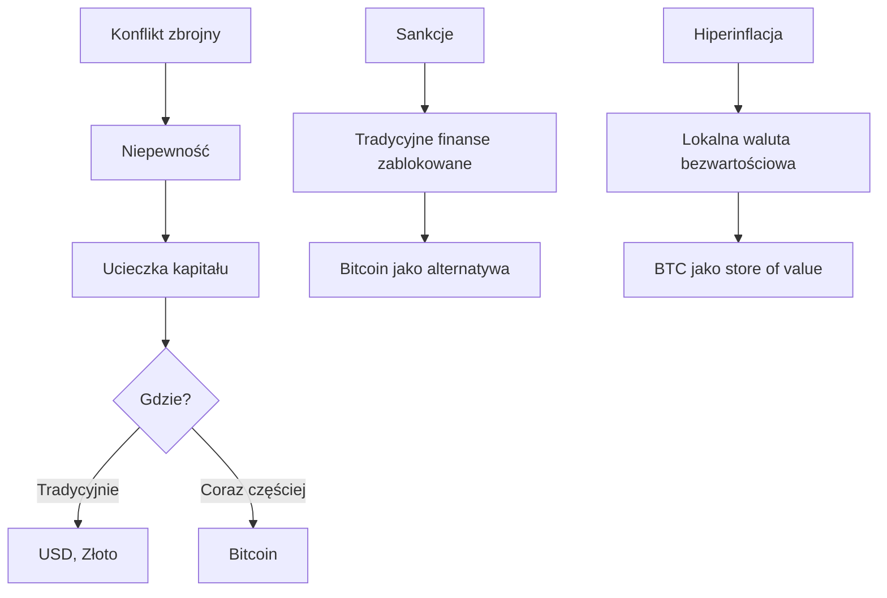
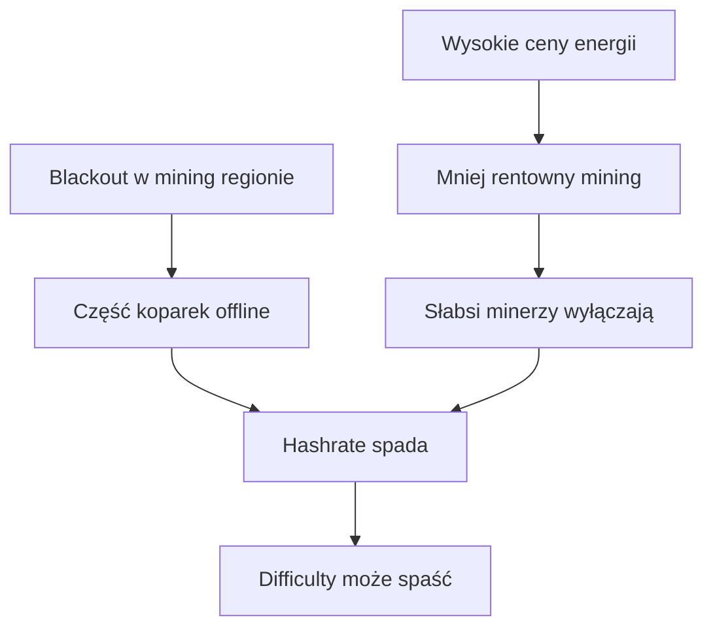
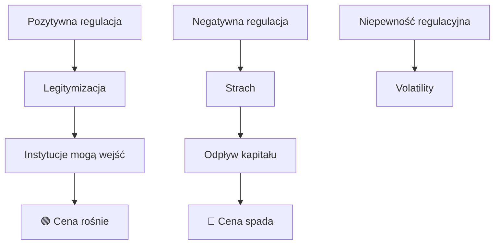
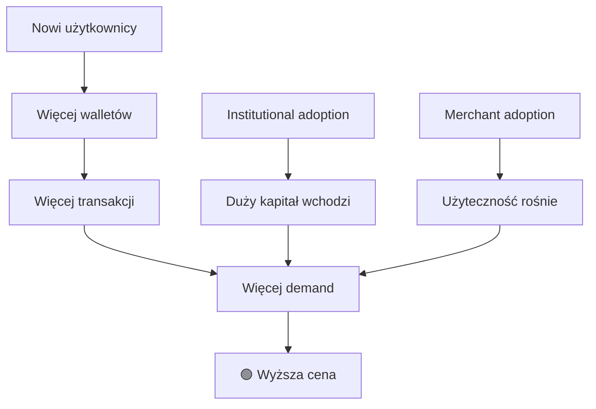

# 🌍 Geopolityka i Infrastruktura

## Wprowadzenie

Geopolityka i infrastruktura to "grey area" - mogą mieć ogromny wpływ na BTC, ale rzadko i trudno je kwantyfikować.

---

## 1. Geopolityka

### Teoria

Bitcoin jako:
- **Safe haven** w niestabilnych regionach
- **Sanction bypass** dla krajów pod sankcjami
- **Inflation hedge** w krajach z problemami waluty



### Historyczne przykłady

| Wydarzenie | Data | Efekt na BTC |
|------------|------|--------------|
| **Grecja** - bank run | 2015 | +10% |
| **Brexit** | 2016 | +7% w 24h |
| **Turcja** - kryzys liry | 2018 | +15% w Turcji, globalnie stabilny |
| **COVID-19** ogłoszenie | 2020-03 | -50% (risk-off), potem +300% |
| **Russia-Ukraine** | 2022-02 | -5% initially, potem wzrost |
| **US Banking Crisis** | 2023-03 | +40% w miesiąc |
| **Israel-Hamas** | 2023-10 | Minimalny wpływ |

### Źródła danych

| Źródło | Typ | Koszt |
|--------|-----|-------|
| **GDELT** ✅ | Event Database | Free |
| ACLED | Conflict data | Academic/Paid |
| Global Peace Index | Roczny raport | Free |
| Geopolitical Risk Index | Miesięczny | Free (academic) |
| Reuters/AP | News | API: $$$$ |

### GDELT dla geopolityki (już mamy!)

```python
# Przykładowe GDELT query dla geopolityki
geopolitical_themes = [
    'TAX_FNCACT_SANCTIONS',  # Sankcje
    'WB_2024_WAR',  # Wojna
    'CRISISLEX_CRISISLEXREC',  # Kryzysy
    'GENERAL_GOVERNMENT',  # Działania rządów
    'ECON_BANKRUPTCY',  # Bankructwa
]

# Filtruj artykuły o krypto + geopolityka
sql = """
SELECT DATE, Actor1CountryCode, GoldsteinScale, NumMentions
FROM gdelt.events
WHERE THEMES LIKE '%CRYPTOCURRENCY%'
  AND THEMES LIKE ANY(geopolitical_themes)
  AND DATE > 20240101
"""
```

### Feature Ideas

```python
def geopolitical_features():
    return {
        # Ogólne
        'global_tension_score': float,  # GDELT agregat
        'conflict_news_count_24h': int,
        'sanction_news_count_24h': int,
        
        # Regiony
        'us_political_tension': float,
        'china_us_tension': float,
        'middle_east_tension': float,
        'russia_tension': float,
        
        # Ekonomiczne
        'banking_crisis_mentions': int,
        'inflation_crisis_mentions': int,
        
        # Sentiment
        'avg_goldstein_scale': float,  # GDELT: -10 to +10
    }
```

### Ocena

| Kryterium | Ocena (1-5) | Uwagi |
|-----------|-------------|-------|
| Potencjał predykcyjny | ⭐⭐⭐⭐ | Wysoki przy dużych wydarzeniach |
| Dla 1h predykcji | ⭐⭐⭐ | Tak, gdy breaking news |
| Dostępność | ⭐⭐⭐⭐ | GDELT już w projekcie! |
| Częstość wydarzeń | ⭐⭐ | Rzadkie "game changers" |

---

## 2. Infrastruktura Energetyczna

### Teoria

Mining BTC wymaga DUŻO energii. Problemy energetyczne → problemy z hashrate.



### Kluczowe regiony mining

| Region | % Hashrate (2024) | Energia |
|--------|-------------------|---------|
| USA (Texas, NY) | ~35% | Różne |
| China (ukryte) | ~15% | Hydro/Coal |
| Kazakhstan | ~8% | Coal |
| Russia | ~7% | Gas/Hydro |
| Canada | ~6% | Hydro |
| Other | ~29% | Różne |

### Historyczne wydarzenia

| Wydarzenie | Data | Efekt |
|------------|------|-------|
| Texas winter storm | 2021-02 | Hashrate -20% temporary |
| China ban | 2021-05 | Hashrate -50%, cena -30% |
| Kazakhstan protests | 2022-01 | Hashrate -15% temporary |
| ERCOT curtailment | 2023-08 | Hashrate -10% |

### Źródła danych

| Źródło | Dane | Koszt |
|--------|------|-------|
| EIA (US Energy) | US grid data | Free |
| ERCOT (Texas) | Texas grid real-time | Free |
| Gridwatch (Europe) | EU grid | Free |
| NOAA | Weather impacts | Free |

### Implementacja

```python
import requests

# Texas ERCOT Grid Condition
def get_ercot_condition():
    url = "https://www.ercot.com/api/1/services/read/dashboards/systemConditions"
    response = requests.get(url)
    data = response.json()
    return {
        'current_load_mw': data['data']['currentLoad'],
        'capacity_mw': data['data']['capacity'],
        'load_percentage': data['data']['currentLoad'] / data['data']['capacity'],
        'is_emergency': data['data']['isEmergency'],
    }
```

### Ocena

| Kryterium | Ocena (1-5) | Uwagi |
|-----------|-------------|-------|
| Potencjał predykcyjny | ⭐⭐ | Rzadkie znaczące wydarzenia |
| Dla 1h predykcji | ⭐ | Zbyt wolna reakcja |
| Dostępność | ⭐⭐⭐⭐ | Publiczne dane grid |
| Warto monitorować | ✅ | Jako alert, nie feature |

---

## 3. Internet Outages

### Teoria

BTC wymaga internetu. Duże outages mogą wpływać na dostępność.

### Historyczne

| Wydarzenie | Efekt |
|------------|-------|
| Cloudflare outage (2019) | Krótkoterminowa panika, minimalna zmiana ceny |
| AWS outage (2021) | Niektóre giełdy offline, ale nie BTC |
| Meta outage (2021) | Brak wpływu na BTC |

### Monitorowanie

```python
# Cloudflare Radar (publiczne dane)
# https://radar.cloudflare.com/outage-center

# Downdetector API (jeśli dostępne)
# Lub scraping głównych platform
```

### Ocena

| Kryterium | Ocena (1-5) | Uwagi |
|-----------|-------------|-------|
| Potencjał predykcyjny | ⭐ | Minimalny |
| Warto monitorować | 🤔 | Raczej nie |

---

## 4. Regulacje i Polityka

### Teoria

Regulacje krypto mają OGROMNY wpływ:
- Pozytywne (ETF approval) → boom
- Negatywne (bany) → crash



### Przykłady historyczne

| Wydarzenie | Data | Efekt |
|------------|------|-------|
| China ban (wielokrotnie) | 2013, 2017, 2021 | -20% do -50% |
| SEC vs XRP | 2020 | XRP -70%, BTC minimalny |
| BTC Futures CME | 2017-12 | Szczyt bańki, potem crash |
| ETF spot approval | 2024-01 | +50% w miesiące |

### Źródła

| Źródło | Typ |
|--------|-----|
| SEC.gov | Oficjalne decyzje |
| Cointelegraph | Krypto newsy |
| The Block | Regulatory news |
| GDELT ✅ | Agregat |

### Implementacja

```python
# Monitoring regulacji przez GDELT/newsy
regulatory_keywords = [
    'SEC cryptocurrency',
    'Bitcoin ETF',
    'crypto regulation',
    'crypto ban',
    'CFTC bitcoin',
    'stablecoin regulation',
]

# Monitoruj i oceniaj sentiment
```

### Ocena

| Kryterium | Ocena (1-5) | Uwagi |
|-----------|-------------|-------|
| Potencjał predykcyjny | ⭐⭐⭐⭐⭐ | **BARDZO WYSOKI** |
| Dla 1h predykcji | ⭐⭐⭐⭐ | TAK przy breaking news |
| Dostępność | ⭐⭐⭐⭐ | GDELT + newsy |
| Implementacja | ⭐⭐⭐ | Wymaga NLP/LLM |

---

## 5. Klęski Żywiołowe

### Teoria

Klęski mogą wpływać przez:
1. Mining disruption (energia, internet)
2. Makro sentiment (risk-off)
3. Regionalne flows

### Historyczne

| Wydarzenie | Efekt na BTC |
|------------|--------------|
| Earthquake Japan (2011) | Minimalny (BTC bardzo mały) |
| Hurricane Harvey (2017) | Brak wpływu |
| COVID-19 (2020) | -50%, potem recovery |
| Floods China (2020) | Hashrate disruption |

### Źródła

| Źródło | Dane | Koszt |
|--------|------|-------|
| USGS | Earthquakes | Free |
| NOAA | Hurricanes, weather | Free |
| GDELT | News about disasters | Free |
| EM-DAT | Disaster database | Academic |

### Ocena

| Kryterium | Ocena (1-5) | Uwagi |
|-----------|-------------|-------|
| Potencjał predykcyjny | ⭐ | Bardzo rzadkie, nieprzewidywalne |
| Dla 1h predykcji | ⭐ | Nie |
| Warto monitorować | 🤔 | Jako context, nie feature |

---

## 6. Adoption Metrics

### Teoria

Rosnąca adopcja = rosnący popyt = rosnąca cena.



### Metryki

| Metryka | Źródło | Znaczenie |
|---------|--------|-----------|
| Active addresses | On-chain | Daily users |
| New addresses | On-chain | New adoption |
| Transaction count | On-chain | Usage |
| Lightning capacity | Lightning | Layer 2 adoption |
| Google Trends | Google | Interest |
| Exchange signups | N/A (private) | New traders |

### Ocena

| Kryterium | Ocena (1-5) | Uwagi |
|-----------|-------------|-------|
| Potencjał predykcyjny | ⭐⭐⭐⭐ | Długoterminowy fundamentalny |
| Dla 1h predykcji | ⭐ | Zbyt wolne zmiany |
| Dostępność | ⭐⭐⭐⭐ | On-chain data |

---

## Podsumowanie: Ranking Geopolityka/Infra

| Źródło | Potencjał 1h | Dostępność | Częstość | Priorytet |
|--------|--------------|------------|----------|-----------|
| **Regulacje** | ⭐⭐⭐⭐ | ⭐⭐⭐⭐ | Rzadkie | 🥇 **WYSOKI** |
| **Geopolityka** | ⭐⭐⭐ | ⭐⭐⭐⭐ | Rzadkie | 🥈 ŚREDNI |
| **Adoption** | ⭐ | ⭐⭐⭐⭐ | Codzienne | 🥉 Długotermin |
| **Energia** | ⭐ | ⭐⭐⭐ | Rzadkie | NISKI |
| **Internet** | ⭐ | ⭐⭐⭐ | Rzadkie | NISKI |
| **Klęski** | ⭐ | ⭐⭐⭐⭐ | Rzadkie | NISKI |

---

## Rekomendacja

### Warto dodać:
1. ✅ **Regulatory news monitoring** - przez GDELT + LLM
2. ✅ **Geopolitical tension score** - GDELT Goldstein

### Alert system (nie features):
3. ⚠️ **Grid emergencies** - monitoring Texas
4. ⚠️ **Major disasters** - GDELT filtering

### Nie priorytet:
5. 🔬 Internet outages - prawdopodobnie minimalny wpływ, ale warto zweryfikować
6. 🔬 Adoption metrics - prawdopodobnie długoterminowe, ale trend może być użyteczny

---

*Dokument stworzony: 2025-12-24 | Autor: Claude Opus 4.5*

