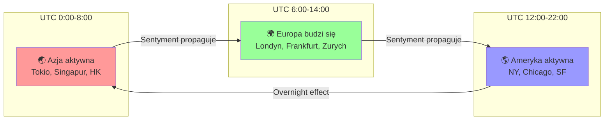
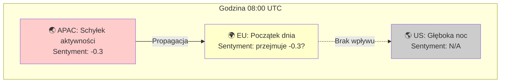
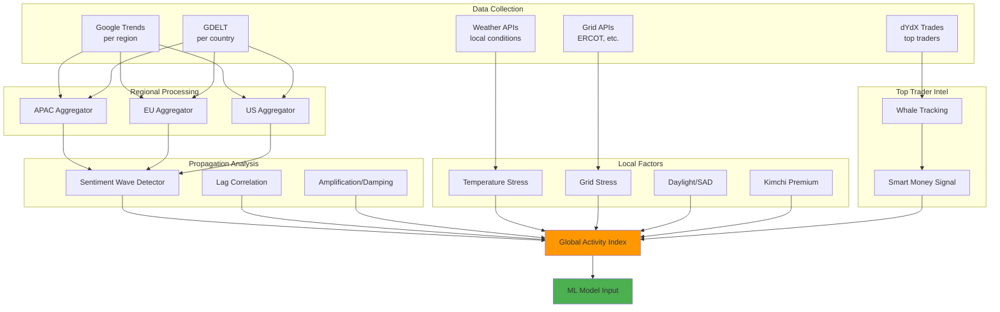

# 🌍 Propagacja Spatio-Temporal: Fale Sentymentu i Czynników

## Wprowadzenie

To jest **innowacyjne podejście**, które analizuje jak czynniki wpływające na rynek **propagują się przez świat** w miarę jak różne regiony się budzą i zasypiają.

**Kluczowa obserwacja**: Rynek krypto działa 24/7, ale ludzie NIE. Azja budzi się gdy Ameryka zasypia. Sentyment, decyzje i kapitał przepływają falami przez strefy czasowe.

---

## 1. Koncepcja: Global Sentiment Wave

### Diagram: 24-godzinny cykl globalny



### Teoria Propagacji

```
Scenariusz: 
1. 🌏 04:00 UTC - W Chinach coś się dzieje (regulacja, news)
2. 🌏 05:00 UTC - Sentyment w Azji spada, Google Trends "bitcoin crash" rośnie
3. 🌍 07:00 UTC - Europa się budzi, widzi overnight spadki
4. 🌍 08:00 UTC - Europejczycy reagują, sentyment kontynuuje
5. 🌎 14:00 UTC - Wall Street otwiera, widzi chaos
6. 🌎 15:00 UTC - Instytucje USA reagują (lub nie)
7. 🌏 22:00 UTC - Azja budzi się do nowej rzeczywistości
```

---

## 2. Framework: Multi-Region Sentiment Tracking

### 2.1 Definicja Regionów

| Region | Kod | Główne strefy czasowe | Aktywne godziny (UTC) |
|--------|-----|----------------------|----------------------|
| **Asia-Pacific** | APAC | UTC+8 to UTC+12 | 22:00 - 10:00 |
| **Europe** | EU | UTC+0 to UTC+3 | 06:00 - 18:00 |
| **Americas** | US | UTC-8 to UTC-3 | 12:00 - 02:00 |
| **Middle East** | ME | UTC+3 to UTC+5 | 04:00 - 16:00 |

### 2.2 Diagram: Nakładające się okna aktywności

```mermaid
gantt
    title Globalne Okna Aktywności (UTC)
    dateFormat HH
    axisFormat %H:00
    
    section APAC
    Peak Activity     :active, 00, 8h
    Winding Down     :02, 4h
    
    section EU
    Wake Up          :06, 2h
    Peak Activity    :active, 08, 8h
    
    section US
    Wake Up          :13, 2h
    Peak Activity    :active, 14, 8h
    After Hours      :22, 4h
```



### 2.3 Overlap Windows - Kluczowe Momenty

| Window | Czas UTC | Regiony | Znaczenie |
|--------|----------|---------|-----------|
| **Asia-EU Handoff** | 06:00-10:00 | APAC + EU | Europa przejmuje od Azji |
| **EU-US Overlap** | 13:00-17:00 | EU + US | **NAJWYŻSZA PŁYNNOŚĆ** |
| **US-Asia Handoff** | 22:00-02:00 | US + APAC | Ameryka zamyka, Azja otwiera |
| **Asia Night Gap** | 10:00-22:00 | EU + US (no Asia) | Azja śpi |

---

## 3. Wskaźniki Propagacji

### 3.1 Sentiment Propagation Index (SPI)

**Definicja**: Mierzy jak szybko i silnie sentyment z jednego regionu wpływa na kolejny.

```python
def calculate_sentiment_propagation(
    asia_sentiment: float,
    eu_sentiment: float, 
    us_sentiment: float,
    lag_hours: int = 4
) -> dict:
    """
    Oblicz wskaźnik propagacji sentymentu między regionami.
    
    Returns:
        dict z wskaźnikami propagacji
    """
    return {
        # Czy EU podąża za Azją?
        'asia_to_eu_correlation': correlate_lagged(
            asia_sentiment, eu_sentiment, lag=lag_hours
        ),
        
        # Czy US podąża za EU?
        'eu_to_us_correlation': correlate_lagged(
            eu_sentiment, us_sentiment, lag=lag_hours
        ),
        
        # Overnight effect: US → Asia następnego dnia
        'us_to_asia_overnight': correlate_lagged(
            us_sentiment, asia_sentiment, lag=12
        ),
        
        # Szybkość propagacji (jak szybko reagują kolejne regiony)
        'propagation_speed': calculate_propagation_delay(
            asia_sentiment, eu_sentiment, us_sentiment
        ),
        
        # Amplifikacja lub tłumienie
        'amplification_factor': eu_sentiment / asia_sentiment if asia_sentiment != 0 else 0,
    }
```

### 3.2 Regional Activity Heatmap



---

## 4. Źródła Danych per Region

### 4.1 Google Trends - Minutowe/Godzinne per Region

```python
from pytrends.request import TrendReq

def get_regional_trends(keyword: str = "bitcoin"):
    """Pobierz trendy dla różnych regionów."""
    pytrends = TrendReq()
    
    regions = {
        'US': 'united_states',
        'GB': 'united_kingdom', 
        'DE': 'germany',
        'JP': 'japan',
        'KR': 'south_korea',
        'CN': 'china',  # ograniczone
        'SG': 'singapore',
        'AU': 'australia',
    }
    
    results = {}
    for code, geo in regions.items():
        pytrends.build_payload([keyword], geo=code, timeframe='now 7-d')
        data = pytrends.interest_over_time()
        results[code] = data
    
    return results
```

### 4.2 GDELT - Sentiment per Region

```sql
-- GDELT: Sentiment per region w czasie
SELECT 
    DATE_TRUNC('hour', SQLDATE) as hour,
    Actor1CountryCode as country,
    AVG(AvgTone) as avg_sentiment,
    COUNT(*) as article_count
FROM gdelt.events
WHERE THEMES LIKE '%CRYPTOCURRENCY%'
  AND SQLDATE >= '2024-01-01'
GROUP BY 1, 2
ORDER BY 1, 2;
```

### 4.3 dYdX - Top Traders Tracking

```python
def get_top_trader_activity(
    trader_addresses: list,
    lookback_hours: int = 24
) -> dict:
    """
    Śledź aktywność najlepszych traderów na dYdX.
    
    Args:
        trader_addresses: Lista adresów do śledzenia
        lookback_hours: Ile godzin wstecz patrzeć
    """
    # dYdX API lub dane z bazy
    trades = query_dydx_trades(
        addresses=trader_addresses,
        hours=lookback_hours
    )
    
    return {
        'total_volume': sum(t.size for t in trades),
        'net_position': calculate_net_position(trades),
        'last_trade': trades[-1] if trades else None,
        'is_buying': trades[-1].side == 'BUY' if trades else None,
        'trade_count': len(trades),
    }
```

---

## 5. Czynniki Lokalne per Region

### 5.1 Tabela: Czynniki Regionalne

| Region | Czynnik | Źródło | Wpływ |
|--------|---------|--------|-------|
| **US - Silicon Valley** | Temperatura | NOAA/OpenWeather | Ekstremalny upał → mniejsza produktywność |
| **US - Texas** | Obciążenie sieci ERCOT | ERCOT API | Blackout → hashrate spada |
| **Skandynawia** | Długość dnia (polar night) | Astronomical | SAD → zmienione zachowania |
| **Chiny** | Firewall / blokady | Monitoring | Dostępność info → reakcja |
| **Japonia** | Yen/USD | Yahoo Finance | Silna korelacja z risk appetite |
| **Korea** | Kimchi Premium | Exchange data | Arbitraż signal |

### 5.2 Diagram: Lokalne Czynniki

```mermaid
graph TD
    subgraph "Silicon Valley"
        A[Temperatura > 40°C] --> B[Mniejsza aktywność deweloperów?]
        B --> C[Mniej tweetów, commitów?]
    end
    
    subgraph "Skandynawia"
        D[Polar Night<br/>Grudzień-Styczeń] --> E[SAD - Seasonal Depression]
        E --> F[Zmienione risk appetite?]
    end
    
    subgraph "Texas"
        G[ERCOT Emergency] --> H[Mining shutdown]
        H --> I[Hashrate drop]
        I --> J[Difficulty adjustment]
    end
    
    subgraph "Korea"
        K[Kimchi Premium > 5%] --> L[Arbitraż aktywny]
        L --> M[Kapitał napływa do KR]
    end
```



---

## 6. Top Trader Tracking (dYdX Whales)

### 6.1 Identyfikacja Top Traderów

Na dYdX możemy zidentyfikować najlepszych traderów przez:
1. **Historyczne PnL** - kto zarabia konsystentnie
2. **Wolumen** - kto handluje największymi pozycjami
3. **Win Rate** - kto ma najlepszy % wygranych

```python
def identify_top_traders(
    trades_df: pd.DataFrame,
    lookback_days: int = 90,
    min_trades: int = 100
) -> list:
    """
    Zidentyfikuj najlepszych traderów na dYdX.
    """
    # Agreguj per trader
    trader_stats = trades_df.groupby('trader_address').agg({
        'pnl': 'sum',
        'size': 'sum',
        'trade_id': 'count',
    }).rename(columns={'trade_id': 'trade_count'})
    
    # Filtruj
    active_traders = trader_stats[trader_stats['trade_count'] >= min_trades]
    
    # Sortuj po PnL
    top_traders = active_traders.nlargest(100, 'pnl')
    
    return top_traders.index.tolist()
```

### 6.2 Real-time Tracking

```python
class TopTraderMonitor:
    """Monitor aktywności najlepszych traderów w czasie rzeczywistym."""
    
    def __init__(self, top_traders: list):
        self.top_traders = set(top_traders)
        self.recent_trades = []
        
    def on_new_trade(self, trade: dict):
        """Callback gdy pojawi się nowy trade."""
        if trade['trader_address'] in self.top_traders:
            self.recent_trades.append(trade)
            
            # Alert: Top trader zrobił duży trade!
            if trade['size_usd'] > 100_000:
                self.send_alert(
                    f"🐋 Top Trader Alert!\n"
                    f"Trader: {trade['trader_address'][:10]}...\n"
                    f"Action: {trade['side']} {trade['size']} BTC\n"
                    f"Value: ${trade['size_usd']:,.0f}"
                )
    
    def get_aggregate_signal(self) -> dict:
        """Agreguj sygnały od top traderów."""
        recent = [t for t in self.recent_trades 
                  if t['timestamp'] > time.time() - 3600]  # ostatnia godzina
        
        if not recent:
            return {'signal': 'neutral', 'confidence': 0}
        
        buy_volume = sum(t['size'] for t in recent if t['side'] == 'BUY')
        sell_volume = sum(t['size'] for t in recent if t['side'] == 'SELL')
        
        total = buy_volume + sell_volume
        if total == 0:
            return {'signal': 'neutral', 'confidence': 0}
        
        imbalance = (buy_volume - sell_volume) / total
        
        return {
            'signal': 'bullish' if imbalance > 0.2 else 'bearish' if imbalance < -0.2 else 'neutral',
            'confidence': abs(imbalance),
            'buy_volume': buy_volume,
            'sell_volume': sell_volume,
            'trade_count': len(recent),
        }
```

---

## 7. Composite Regional Index

### 7.1 Definicja

**Global Activity Index (GAI)** - composite index uwzględniający wszystkie regiony i czynniki.

```python
def calculate_global_activity_index(
    timestamp: datetime,
    regional_data: dict
) -> dict:
    """
    Oblicz Global Activity Index.
    
    Args:
        timestamp: Aktualny czas UTC
        regional_data: Dict z danymi per region
    
    Returns:
        Dict z GAI i składnikami
    """
    hour = timestamp.hour
    
    # Wagi aktywności per region (zależne od pory)
    activity_weights = get_activity_weights(hour)
    
    # Sentyment ważony aktywnością
    weighted_sentiment = sum(
        regional_data[region]['sentiment'] * activity_weights[region]
        for region in ['APAC', 'EU', 'US']
    )
    
    # Czynniki lokalne
    local_factors = {
        'texas_grid_stress': regional_data.get('texas_ercot', 0),
        'silicon_valley_temp': regional_data.get('sf_temperature', 0),
        'scandinavia_daylight': regional_data.get('oslo_daylight_hours', 12),
        'kimchi_premium': regional_data.get('korea_premium', 0),
    }
    
    # Top trader signal
    top_trader_signal = regional_data.get('dydx_top_traders', {})
    
    return {
        'timestamp': timestamp,
        'gai_score': weighted_sentiment,
        'activity_weights': activity_weights,
        'leading_region': max(activity_weights, key=activity_weights.get),
        'local_factors': local_factors,
        'top_trader_signal': top_trader_signal,
        'propagation_direction': infer_propagation_direction(regional_data),
    }


def get_activity_weights(hour_utc: int) -> dict:
    """
    Zwróć wagi aktywności per region na podstawie godziny UTC.
    """
    # Simplified model - można rozbudować
    weights = {
        'APAC': max(0, 1 - abs(hour_utc - 2) / 6),   # Peak at 02:00 UTC
        'EU': max(0, 1 - abs(hour_utc - 12) / 6),    # Peak at 12:00 UTC
        'US': max(0, 1 - abs(hour_utc - 18) / 6),    # Peak at 18:00 UTC
    }
    
    # Normalize
    total = sum(weights.values())
    return {k: v/total for k, v in weights.items()}
```

---

## 8. Diagram: Pełny Pipeline



---

## 9. Przykładowe Scenariusze

### Scenariusz 1: Azjatycki FUD propaguje na zachód

```
Timeline:
├── 02:00 UTC: 🌏 Chiny ogłaszają nową regulację
├── 02:30 UTC: 🌏 Google Trends "bitcoin ban" spikuje w CN, JP, KR
├── 04:00 UTC: 🌏 Azjatyckie giełdy pokazują -5%
├── 06:00 UTC: 🌍 Europa się budzi, widzi czerwień
├── 07:00 UTC: 🌍 EU Google Trends zaczynają rosnąć
├── 08:00 UTC: 🌍 EU sentyment spada, GDELT tone negatywny
├── 13:00 UTC: 🌎 US pre-market, futures reagują
├── 14:30 UTC: 🌎 Wall Street otwiera, VIX rośnie
└── 16:00 UTC: 🌎 Maksymalna panika lub stabilizacja

ML Features:
- asia_sentiment_6h_ago: -0.7
- eu_sentiment_now: -0.5
- propagation_speed: 4h
- us_premarket_reaction: -0.3
- top_traders_action: SELLING
```

### Scenariusz 2: US Bullish overnight dla Azji

```
Timeline:
├── 20:00 UTC: 🌎 Pozytywne newsy w US (ETF inflows)
├── 21:00 UTC: 🌎 US sentyment rośnie
├── 23:00 UTC: 🌎 US zamyka na highs
├── 00:00 UTC: 🌏 Azja się budzi, widzi zielono
├── 01:00 UTC: 🌏 FOMO w Korei, Kimchi Premium rośnie
├── 02:00 UTC: 🌏 Japonia podąża
├── 06:00 UTC: 🌍 Europa budzi się do rally
└── 14:00 UTC: 🌎 US kontynuuje lub realizuje zyski

ML Features:
- us_closing_sentiment: +0.8
- asia_opening_reaction: +0.6
- kimchi_premium: +3%
- overnight_gap: +2%
- continuation_probability: HIGH
```

### Scenariusz 3: Silicon Valley Heat Wave

```
Timeline:
├── 18:00 UTC: 🌎 Temperatura w SF: 42°C
├── 19:00 UTC: 🌎 GitHub commits spadają o 30%
├── 20:00 UTC: 🌎 Twitter activity z SF spada
├── 21:00 UTC: 🌎 Mniej newsów, mniejsza zmienność
├── 22:00 UTC: 🌏 Azja nie ma sygnałów z US
└── 00:00 UTC: 🌏 Niepewność, range-bound trading

ML Features:
- sf_temperature: 42
- github_activity_change: -0.3
- us_social_volume: -0.25
- expected_volatility: LOW
```

---

## 10. Implementacja: Database Schema

### Nowe tabele

```sql
-- Sentyment per region
CREATE TABLE regional_sentiment (
    timestamp TIMESTAMPTZ NOT NULL,
    region VARCHAR(10) NOT NULL,  -- 'APAC', 'EU', 'US', 'ME'
    country_code VARCHAR(3),
    
    -- Sentyment
    google_trends_score DECIMAL(10, 4),
    gdelt_tone DECIMAL(10, 4),
    social_volume INTEGER,
    
    -- Metryki
    activity_level DECIMAL(10, 4),  -- 0-1
    is_peak_hours BOOLEAN,
    
    PRIMARY KEY (timestamp, region, country_code)
);

SELECT create_hypertable('regional_sentiment', 'timestamp');


-- Czynniki lokalne
CREATE TABLE local_factors (
    timestamp TIMESTAMPTZ NOT NULL,
    location VARCHAR(50) NOT NULL,  -- 'silicon_valley', 'texas', 'oslo'
    
    -- Weather
    temperature_c DECIMAL(5, 2),
    weather_condition VARCHAR(50),
    
    -- Energy
    grid_load_percent DECIMAL(5, 2),
    is_grid_emergency BOOLEAN,
    
    -- Daylight
    daylight_hours DECIMAL(4, 2),
    
    PRIMARY KEY (timestamp, location)
);

SELECT create_hypertable('local_factors', 'timestamp');


-- Top Traders dYdX
CREATE TABLE dydx_top_traders (
    trader_address VARCHAR(100) PRIMARY KEY,
    total_pnl DECIMAL(20, 8),
    win_rate DECIMAL(5, 4),
    total_volume DECIMAL(20, 8),
    trade_count INTEGER,
    last_updated TIMESTAMPTZ
);


-- Top Trader Activities
CREATE TABLE dydx_top_trader_trades (
    id SERIAL PRIMARY KEY,
    timestamp TIMESTAMPTZ NOT NULL,
    trader_address VARCHAR(100) REFERENCES dydx_top_traders(trader_address),
    ticker VARCHAR(20),
    side VARCHAR(10),
    size DECIMAL(20, 8),
    price DECIMAL(20, 8),
    pnl DECIMAL(20, 8)
);

SELECT create_hypertable('dydx_top_trader_trades', 'timestamp');


-- Propagation Metrics
CREATE TABLE sentiment_propagation (
    timestamp TIMESTAMPTZ PRIMARY KEY,
    
    -- Korelacje
    asia_to_eu_corr DECIMAL(5, 4),
    eu_to_us_corr DECIMAL(5, 4),
    us_to_asia_corr DECIMAL(5, 4),
    
    -- Prędkość propagacji (godziny)
    propagation_speed_hours DECIMAL(4, 2),
    
    -- Amplifikacja
    amplification_factor DECIMAL(5, 4),
    
    -- Leading region
    leading_region VARCHAR(10),
    
    -- Global Activity Index
    gai_score DECIMAL(10, 4)
);

SELECT create_hypertable('sentiment_propagation', 'timestamp');
```

---

## 11. Ocena i Priorytet

| Aspekt | Ocena | Uwagi |
|--------|-------|-------|
| **Innowacyjność** | ⭐⭐⭐⭐⭐ | Bardzo oryginalny pomysł |
| **Potencjał predykcyjny** | ⭐⭐⭐⭐ | Wysokie - wykorzystuje czasowe zależności |
| **Złożoność implementacji** | ⭐⭐⭐ | Wymaga wielu źródeł danych |
| **Badania naukowe** | ⭐⭐ | Mało bezpośrednich (nowatorskie!) |
| **Dostępność danych** | ⭐⭐⭐⭐ | Większość dostępna |

### Priorytet implementacji

1. 🥇 **Regional Google Trends** - najłatwiejsze, natychmiastowy insight
2. 🥈 **GDELT per country** - już mamy GDELT, łatwe rozszerzenie
3. 🥉 **Top Trader Tracking** - mamy dane dYdX, trzeba zbudować logikę
4. 4️⃣ **Local weather** - OpenWeather API, proste
5. 5️⃣ **Grid stress** - ERCOT API, specyficzne
6. 6️⃣ **Propagation metrics** - wymaga historii pozostałych

---

## 12. Badania i Inspiracje

| Temat | Źródło | Wynik |
|-------|--------|-------|
| "Time Zone Effects in Global Markets" | Academic (2019) | Potwierdzone handoff effects |
| "Information Propagation Across Time Zones" | Journal of Finance | 4-6h lag między Azją a US |
| "Cryptocurrency Trading Hours" | CryptoCompare | 70% wolumenu w overlap periods |
| Smart Money tracking | Hedge fund strategies | Institutional practice |

---

*Dokument stworzony: 2025-12-24 | Autor: Claude Opus 4.5*

