# 🫀 Rynek Krypto jako Żywy Organizm

## Wprowadzenie

**Hipoteza**: Rynek kryptowalut można modelować jako żywy organizm, z własnymi wskaźnikami "zdrowia", cyklami życiowymi i reakcjami na bodźce. Pojęcia medyczne i biologiczne mogą dostarczyć nowych perspektyw i metryk dla predykcji.

**Status**: 🔬 **ETAP BADAWCZY** - teoria do empirycznej weryfikacji

---

## 1. Anatomia Rynku

### 1.1 Mapowanie Organów

```mermaid
graph TD
    subgraph "🧠 Mózg - Decyzje i Sentyment"
        A[Twitter/Social Media<br/>Myśli zbiorowe]
        B[News/GDELT<br/>Bodźce zewnętrzne]
        C[Fear & Greed<br/>Emocje]
    end
    
    subgraph "🫀 Serce - Przepływ kapitału"
        D[Order Flow<br/>Puls rynku]
        E[Volume<br/>Siła pompowania]
        F[Liquidity<br/>Krew w systemie]
    end
    
    subgraph "🫁 Płuca - Wymiana z otoczeniem"
        G[Exchange Inflows/Outflows<br/>Oddech]
        H[Stablecoin Flows<br/>Tlen finansowy]
    end
    
    subgraph "💪 Mięśnie - Siła wykonawcza"
        I[Miners/Hashrate<br/>Siła robocza]
        J[Validators<br/>Koordynacja]
    end
    
    subgraph "🦴 Szkielet - Struktura"
        K[Blockchain<br/>Kręgosłup]
        L[Protocol Rules<br/>DNA]
    end
    
    subgraph "🩸 Układ krwionośny"
        M[Lightning Network<br/>Kapilary]
        N[L2 Solutions<br/>Naczynia]
    end
    
    A --> D
    B --> C
    C --> D
    D --> E
    E --> G
    G --> H
    I --> K
```



### 1.2 Tabela Mapowania: Medycyna → Rynek

| Pojęcie medyczne | Odpowiednik rynkowy | Metryka | Źródło |
|------------------|---------------------|---------|--------|
| **Puls (HR)** | Częstotliwość transakcji | TPS, trade count/min | Blockchain, dYdX |
| **Ciśnienie krwi** | Order book depth / spread | Bid-Ask spread, slippage | Exchange API |
| **Temperatura** | Volatility | ATR, Bollinger Width | OHLCV |
| **Gorączka** | Ekstremalna zmienność | VIX > 30, ATR spike | Calculated |
| **Tętno spoczynkowe** | Baseline volume | 30d avg volume | OHLCV |
| **Saturacja O2** | Płynność stablecoinów | USDT/USDC market cap | CoinGecko |
| **Poziom cukru** | Funding rate | Funding rate 8h | dYdX, Binance |
| **Poziom kortyzolu** | Fear & Greed Index | 0-100 scale | Alternative.me |
| **Adrenalina** | Volume spike | Volume vs avg ratio | OHLCV |
| **Układ odpornościowy** | Hashrate / network security | Hashrate | Blockchain |
| **Regeneracja** | Mean reversion | Z-score normalization | Calculated |
| **Homeostaza** | Range-bound trading | Bollinger squeeze | Calculated |

---

## 2. Wskaźniki Stanu Zdrowia Rynku

### 2.1 Vital Signs Dashboard

```python
class MarketVitalSigns:
    """Monitor zdrowia rynku - vital signs w czasie rzeczywistym."""
    
    def __init__(self):
        self.vital_thresholds = {
            'pulse': {'low': 50, 'normal': 100, 'high': 200, 'critical': 500},
            'blood_pressure': {'low': 0.01, 'normal': 0.05, 'high': 0.1, 'critical': 0.2},
            'temperature': {'hypothermia': 0.5, 'normal': 1.5, 'fever': 3.0, 'critical': 5.0},
            'oxygen_saturation': {'critical': 0.7, 'low': 0.85, 'normal': 0.95},
        }
    
    def get_pulse(self, trades_per_minute: float) -> dict:
        """
        Puls rynku = częstotliwość transakcji.
        
        Interpretacja:
        - Bradykardia (niski): Mała aktywność, brak zainteresowania
        - Normalny: Zdrowy rynek
        - Tachykardia (wysoki): Zwiększona aktywność, potencjalny ruch
        - Krytyczny: Panika lub euforia
        """
        status = self._classify('pulse', trades_per_minute)
        return {
            'value': trades_per_minute,
            'unit': 'trades/min',
            'status': status,
            'interpretation': self._interpret_pulse(status)
        }
    
    def get_blood_pressure(self, bid_ask_spread: float) -> dict:
        """
        Ciśnienie = spread bid-ask.
        
        Interpretacja:
        - Niskie: Wysoka płynność, zdrowy rynek
        - Wysokie: Niska płynność, stres
        - Krytyczne: Market makers wycofują się
        """
        status = self._classify('blood_pressure', bid_ask_spread)
        return {
            'value': bid_ask_spread,
            'unit': '%',
            'status': status,
            'interpretation': self._interpret_bp(status)
        }
    
    def get_temperature(self, volatility_percent: float) -> dict:
        """
        Temperatura = zmienność (ATR % lub std dev returns).
        
        Interpretacja:
        - Hipotermia: Rynek "zamrożony", consolidation
        - Normalny: Zdrowa zmienność
        - Gorączka: Podwyższona aktywność, trend forming
        - Krytyczny: Panika, potencjalny crash lub squeeze
        """
        status = self._classify('temperature', volatility_percent)
        return {
            'value': volatility_percent,
            'unit': '% daily',
            'status': status,
            'interpretation': self._interpret_temp(status)
        }
    
    def get_oxygen_saturation(self, stablecoin_ratio: float) -> dict:
        """
        Saturacja O2 = stosunek stablecoinów do BTC market cap.
        
        Interpretacja:
        - Wysoka saturacja: Dużo "tlenu" (gotówki) w systemie, potencjał kupna
        - Niska saturacja: Mało gotówki, ograniczony potencjał wzrostu
        """
        status = self._classify('oxygen_saturation', stablecoin_ratio)
        return {
            'value': stablecoin_ratio,
            'unit': 'ratio',
            'status': status,
            'interpretation': self._interpret_o2(status)
        }
    
    def get_full_vitals(self, data: dict) -> dict:
        """Pełny raport vital signs."""
        return {
            'timestamp': data.get('timestamp'),
            'pulse': self.get_pulse(data.get('trades_per_minute', 0)),
            'blood_pressure': self.get_blood_pressure(data.get('spread', 0)),
            'temperature': self.get_temperature(data.get('volatility', 0)),
            'oxygen_saturation': self.get_oxygen_saturation(data.get('stablecoin_ratio', 0)),
            'overall_health': self._calculate_health_score(data),
        }
    
    def _calculate_health_score(self, data: dict) -> dict:
        """
        Composite health score 0-100.
        
        Analogia: Ogólny stan zdrowia pacjenta.
        """
        # Simplified scoring
        score = 50  # baseline
        
        # Adjust based on vitals
        # ... logic ...
        
        return {
            'score': score,
            'status': 'stable' if 40 <= score <= 60 else 'stressed' if score < 40 else 'euphoric',
        }
```

### 2.2 Diagram: Vital Signs Dashboard

```mermaid
graph TD
    subgraph "🏥 Market Health Dashboard"
        A[🫀 Puls<br/>142 trades/min<br/>⚠️ ELEVATED]
        B[🩸 Ciśnienie<br/>0.08% spread<br/>✅ NORMAL]
        C[🌡️ Temperatura<br/>3.2% volatility<br/>🔥 FEVER]
        D[💨 Saturacja O2<br/>0.92 ratio<br/>✅ NORMAL]
    end
    
    A --> E[Overall Health Score]
    B --> E
    C --> E
    D --> E
    
    E --> F{Health Status}
    F -->|Score < 30| G[🔴 CRITICAL<br/>Intensive care needed]
    F -->|30-70| H[🟡 STRESSED<br/>Monitor closely]
    F -->|> 70| I[🟢 HEALTHY<br/>Normal operation]
    
    style A fill:#fff3cd
    style C fill:#f8d7da
    style E fill:#d4edda
```



---

## 3. Stany Patologiczne Rynku

### 3.1 Katalog "Chorób" Rynku

| Stan patologiczny | Objawy rynkowe | Metryki | Typowy przebieg |
|-------------------|----------------|---------|-----------------|
| **Gorączka spekulacyjna** | Ekstremalna zmienność, FOMO | ATR > 5%, F&G > 80 | 1-3 dni, kończy się korektą |
| **Hipotermia** | Brak zmienności, apatia | ATR < 0.5%, vol. -50% | Tygodnie, poprzedza ruch |
| **Arytmia** | Nieregularne volume spikes | Volume CV > 2 | Godziny-dni |
| **Tachykardia** | Ekstremalnie wysoka aktywność | TPS > 3x avg | Godziny, stress test |
| **Bradykardia** | Bardzo niska aktywność | TPS < 0.3x avg | Weekendy, święta |
| **Hipoksja** | Brak płynności stablecoin | SSR > 10 | Dni-tygodnie |
| **Hiperglikemia** | Bardzo wysoki funding rate | FR > 0.1% | Godziny, poprzedza korektę |
| **Hipoglikemia** | Bardzo niski/ujemny FR | FR < -0.05% | Godziny, poprzedza odbicie |
| **Zapalenie** | Negatywny sentyment viral | GDELT tone < -5 | Dni |
| **Wstrząs septyczny** | Cascade liquidations | OI drop > 30%, cascade | Godziny, critical |
| **Atak paniki** | Flash crash | -10% w < 1h | Minuty-godziny |
| **Euforia maniakalna** | Parabolic rise | +20% w 24h, F&G > 90 | Dni, kończy się crashem |

### 3.2 Diagram: Cykl Chorobowy

```mermaid
stateDiagram-v2
    [*] --> Homeostaza: Zdrowy rynek
    
    Homeostaza --> Gorączka: Positive news / FOMO
    Homeostaza --> Hipotermia: Low interest / Boredom
    
    Gorączka --> Euforia: Continued buying
    Gorączka --> Homeostaza: Cooling off
    
    Euforia --> AtakPaniki: Sudden reversal
    Euforia --> Gorączka: Minor correction
    
    AtakPaniki --> WstrząsSeptyczny: Cascade liquidations
    AtakPaniki --> Regeneracja: Quick recovery
    
    WstrząsSeptyczny --> Rekonwalescencja: Bottom found
    
    Hipotermia --> Przebudzenie: Catalyst / News
    Hipotermia --> DłuższaHibernacja: No catalyst
    
    Przebudzenie --> Gorączka: Breakout
    Przebudzenie --> Homeostaza: False breakout
    
    Rekonwalescencja --> Homeostaza: Full recovery
    Regeneracja --> Homeostaza: V-shape recovery
    
    DłuższaHibernacja --> Przebudzenie: Eventually
```



---

## 4. Medyczne Wskaźniki jako Features ML

### 4.1 Propozycja Feature Set

```python
def calculate_medical_features(market_data: dict) -> dict:
    """
    Oblicz features bazujące na medycznych alegoriach.
    
    Hipoteza: Te features mogą uchwycić patterns niewidoczne
    w tradycyjnych wskaźnikach technicznych.
    """
    
    return {
        # === VITAL SIGNS ===
        'pulse_tpm': market_data['trades_per_minute'],
        'pulse_vs_baseline': market_data['tpm'] / market_data['tpm_30d_avg'],
        'pulse_acceleration': market_data['tpm_1h'] - market_data['tpm_2h'],
        
        'blood_pressure_spread': market_data['bid_ask_spread'],
        'bp_systolic': market_data['max_spread_1h'],  # peak pressure
        'bp_diastolic': market_data['min_spread_1h'],  # min pressure
        
        'temperature_volatility': market_data['atr_percent'],
        'temp_vs_baseline': market_data['atr'] / market_data['atr_30d'],
        'fever_duration_hours': count_consecutive_high_vol_hours(market_data),
        
        'oxygen_saturation': market_data['stablecoin_ratio'],
        'o2_trend': market_data['stablecoin_ratio'] - market_data['stablecoin_ratio_24h_ago'],
        
        # === METABOLIZM ===
        'blood_sugar_funding': market_data['funding_rate'],
        'insulin_response': market_data['funding_rate_change'],  # jak szybko się normalizuje
        
        'cortisol_fear_greed': market_data['fear_greed_index'],
        'adrenaline_volume_spike': market_data['volume'] / market_data['volume_avg'],
        
        # === UKŁAD ODPORNOŚCIOWY ===
        'immune_strength_hashrate': market_data['hashrate_vs_ath'],
        'immune_response_time': market_data['recovery_speed_from_dip'],
        
        # === HOMEOSTAZA ===
        'homeostasis_deviation': abs(market_data['price'] - market_data['price_20d_sma']) / market_data['price_20d_sma'],
        'mean_reversion_pressure': calculate_mean_reversion_pressure(market_data),
        
        # === STANY PATOLOGICZNE (binary) ===
        'is_fever': market_data['atr_percent'] > 3.0,
        'is_hypothermia': market_data['atr_percent'] < 0.5,
        'is_tachycardia': market_data['tpm'] > 3 * market_data['tpm_avg'],
        'is_hypoglycemia': market_data['funding_rate'] < -0.05,
        'is_hyperglycemia': market_data['funding_rate'] > 0.1,
        'is_panic_attack': market_data['return_1h'] < -0.05,
        'is_euphoria': market_data['fear_greed'] > 85,
        
        # === COMPOSITE SCORES ===
        'health_score': calculate_overall_health(market_data),
        'illness_severity': calculate_illness_severity(market_data),
        'recovery_probability': predict_recovery_probability(market_data),
    }
```

### 4.2 Testy Diagnostyczne (Analogi medyczne)

| Test medyczny | Odpowiednik rynkowy | Co mierzy | Implementacja |
|---------------|---------------------|-----------|---------------|
| **EKG** | Order flow pattern | Regularność heartbeat | FFT na volume |
| **Ciśnienie tętnicze** | Bid-ask spread trend | Zdrowie płynności | Rolling spread |
| **Morfologia krwi** | Breakdown wolumenu | Skład uczestników | Buy/sell ratio |
| **Tomografia** | On-chain analysis | Głęboka struktura | UTXO analysis |
| **Test wysiłkowy** | Stress test | Reakcja na szok | Response to news |
| **Poziom cukru** | Funding rate | Metabolizm rynku | Exchange API |
| **CRP (zapalenie)** | Sentiment momentum | Inflammation level | GDELT tone change |

---

## 5. Cykle Życiowe Rynku

### 5.1 Cykl Dobowy (Circadian Rhythm)

```mermaid
graph LR
    subgraph "Cykl dobowy BTC"
        A[00:00-06:00 UTC<br/>🌙 Asian Session<br/>Lower volatility] --> B[06:00-12:00 UTC<br/>🌅 EU Wake<br/>Increasing activity]
        B --> C[12:00-18:00 UTC<br/>☀️ US+EU Overlap<br/>Peak activity]
        C --> D[18:00-00:00 UTC<br/>🌆 US Session<br/>High volatility]
        D --> A
    end
```



### 5.2 Cykl Tygodniowy

| Dzień | "Stan organizmu" | Typowe zachowanie |
|-------|------------------|-------------------|
| Poniedziałek | Przebudzenie po weekendzie | Gap fill, direction setting |
| Wtorek-Środa | Pełna aktywność | Trend development |
| Czwartek | Peak metabolizmu | Highest vol often |
| Piątek | Przygotowanie do odpoczynku | Position squaring |
| Weekend | Hibernacja | Low liquidity, gaps |

### 5.3 Cykl Halving (4-letni "sezon życia")

```mermaid
graph TD
    subgraph "Cykl 4-letni"
        A[🌱 Post-halving<br/>SPRING<br/>Accumulation] --> B[☀️ Bull run<br/>SUMMER<br/>Growth]
        B --> C[🍂 Blow-off top<br/>AUTUMN<br/>Distribution]
        C --> D[❄️ Bear market<br/>WINTER<br/>Hibernation]
        D --> A
    end
    
    A -->|"Organizm młody<br/>Building strength"| A1[Low volatility<br/>Quiet accumulation]
    B -->|"Organizm dojrzały<br/>Peak performance"| B1[High growth<br/>Euphoria]
    C -->|"Organizm starzejący się<br/>Weakening"| C1[Distribution<br/>Smart money exits]
    D -->|"Organizm odpoczywający<br/>Regeneration"| D1[Capitulation<br/>Renewal]
```



---

## 6. Terapie i Interwencje

### 6.1 Jak "leczyć" rynek (zrozumienie mechanizmów)

| Stan | "Terapia" | Mechanizm | Obserwowalne efekty |
|------|-----------|-----------|---------------------|
| Gorączka spekulacyjna | Funding rate arbitrage | Wysokie FR przyciąga shorty | FR normalizacja |
| Hipotermia | Catalyst/News | Zewnętrzny bodziec | Volume spike |
| Hipoksja (brak płynności) | Stablecoin mints | Tether/Circle drukują | SSR spada |
| Wstrząs septyczny | Fed/Bailout | Interwencja zewnętrzna | Stabilizacja |
| Atak paniki | Time | Naturalna regeneracja | V-recovery |

### 6.2 Diagram: Interwencje

```mermaid
flowchart TD
    A[Diagnoza stanu] --> B{Jaki stan?}
    
    B -->|Gorączka| C[Obserwuj funding rate]
    C --> C1{FR > 0.1%?}
    C1 -->|Tak| C2[Oczekuj korekty<br/>Organizm się chłodzi]
    C1 -->|Nie| C3[Kontynuacja możliwa]
    
    B -->|Hipotermia| D[Szukaj katalizatora]
    D --> D1[News, Events, Technicals]
    D1 --> D2[Breakout lub kontynuacja range]
    
    B -->|Panic Attack| E[Sprawdź głębokość]
    E --> E1{Liquidation cascade?}
    E1 -->|Tak| E2[Czekaj na wyczerpanie<br/>sprzedających]
    E1 -->|Nie| E3[Możliwe V-recovery]
    
    B -->|Zdrowy| F[Kontynuuj normalną obserwację]
```



---

## 7. Plan Badawczy

### 7.1 Hipotezy do weryfikacji

| # | Hipoteza | Metryka sukcesu | Priorytet |
|---|----------|-----------------|-----------|
| H1 | "Vital signs" mają wartość predykcyjną | Accuracy > baseline | 🥇 |
| H2 | Stany patologiczne poprzedzają ruchy | Lead time > 0 | 🥇 |
| H3 | Health score koreluje z przyszłymi zwrotami | Correlation > 0.3 | 🥈 |
| H4 | Cykle dobowe mają stabilne patterns | Consistency > 70% | 🥈 |
| H5 | "Choroby" mają typowe przebiegi | Pattern recognition | 🥉 |

### 7.2 Metodologia testowania

```python
def test_organism_hypothesis():
    """
    Framework testowania hipotezy organizmu.
    """
    
    # 1. Zbierz dane historyczne
    data = load_historical_data(years=3)
    
    # 2. Oblicz medical features
    features = calculate_medical_features(data)
    
    # 3. Zdefiniuj target
    target = data['return_next_1h'] > 0
    
    # 4. Porównaj z baseline (tylko cena)
    baseline_accuracy = train_baseline_model(data)
    
    # 5. Dodaj medical features
    organism_accuracy = train_model_with_medical_features(features, target)
    
    # 6. Test istotności statystycznej
    significance = statistical_significance_test(baseline_accuracy, organism_accuracy)
    
    return {
        'baseline_accuracy': baseline_accuracy,
        'organism_accuracy': organism_accuracy,
        'improvement': organism_accuracy - baseline_accuracy,
        'significant': significance < 0.05,
    }
```

### 7.3 Timeline

| Faza | Czas | Działania |
|------|------|-----------|
| **Faza 1** | Tydzień 1 | Implementacja vital signs features |
| **Faza 2** | Tydzień 2 | Zbieranie danych, baseline |
| **Faza 3** | Tydzień 3 | Trening modelu z medical features |
| **Faza 4** | Tydzień 4 | Analiza wyników, refinement |
| **Faza 5** | Ongoing | Monitoring real-time, iteration |

---

## 8. Database Schema

### Nowe tabele

```sql
-- Vital signs snapshots
CREATE TABLE market_vital_signs (
    timestamp TIMESTAMPTZ NOT NULL,
    
    -- Puls
    pulse_tpm DECIMAL(10, 2),
    pulse_vs_baseline DECIMAL(5, 4),
    pulse_status VARCHAR(20),
    
    -- Ciśnienie
    blood_pressure_spread DECIMAL(10, 6),
    bp_systolic DECIMAL(10, 6),
    bp_diastolic DECIMAL(10, 6),
    bp_status VARCHAR(20),
    
    -- Temperatura
    temperature_volatility DECIMAL(10, 4),
    temp_vs_baseline DECIMAL(5, 4),
    temp_status VARCHAR(20),
    
    -- Saturacja
    oxygen_saturation DECIMAL(5, 4),
    o2_status VARCHAR(20),
    
    -- Composite
    health_score INTEGER,
    health_status VARCHAR(20),
    
    PRIMARY KEY (timestamp)
);

SELECT create_hypertable('market_vital_signs', 'timestamp');


-- Diagnosed conditions
CREATE TABLE market_conditions (
    id SERIAL PRIMARY KEY,
    start_timestamp TIMESTAMPTZ NOT NULL,
    end_timestamp TIMESTAMPTZ,
    
    condition_type VARCHAR(50) NOT NULL,  -- 'fever', 'hypothermia', etc.
    severity VARCHAR(20),  -- 'mild', 'moderate', 'severe', 'critical'
    
    -- Metrics at diagnosis
    trigger_metric VARCHAR(50),
    trigger_value DECIMAL(20, 8),
    
    -- Outcome (filled after condition ends)
    outcome_price_change DECIMAL(10, 4),
    recovery_time_hours DECIMAL(10, 2),
    
    notes TEXT
);

CREATE INDEX idx_conditions_type ON market_conditions(condition_type);
CREATE INDEX idx_conditions_time ON market_conditions(start_timestamp);
```

---

## 9. Wizualizacja: Health Dashboard

```
╔══════════════════════════════════════════════════════════════════╗
║                    🏥 MARKET HEALTH MONITOR                       ║
╠══════════════════════════════════════════════════════════════════╣
║                                                                   ║
║  🫀 PULS          142 tpm    ▲    [████████░░] ELEVATED          ║
║  🩸 CIŚNIENIE     0.05%      ✓    [██████░░░░] NORMAL            ║
║  🌡️ TEMPERATURA   3.2%       ▲    [████████░░] FEVER             ║
║  💨 SATURACJA     0.92       ✓    [█████████░] NORMAL            ║
║                                                                   ║
║  ═══════════════════════════════════════════════════════════════ ║
║                                                                   ║
║  OVERALL HEALTH SCORE: 62/100  [██████░░░░] STRESSED             ║
║                                                                   ║
║  DIAGNOSIS: Gorączka spekulacyjna (mild)                         ║
║  PROGNOSIS: Możliwa korekta w ciągu 4-12h                        ║
║                                                                   ║
║  ACTIVE CONDITIONS:                                               ║
║  ⚠️ Fever (3.2% vol) - started 2h ago                            ║
║  ⚠️ Tachycardia (142 tpm) - started 1h ago                       ║
║                                                                   ║
╚══════════════════════════════════════════════════════════════════╝
```

---

## 10. Podsumowanie

### Wartość teorii

| Aspekt | Ocena | Uwagi |
|--------|-------|-------|
| **Innowacyjność** | ⭐⭐⭐⭐⭐ | Unikalne podejście |
| **Intuicyjność** | ⭐⭐⭐⭐⭐ | Łatwe do zrozumienia dla ludzi |
| **Testowalność** | ⭐⭐⭐⭐ | Konkretne metryki |
| **Potencjał ML** | 🔬 | Do zbadania empirycznie |
| **Poprzednie badania** | ⭐⭐ | Mało, ale "market psychology" jest znane |

### Kluczowe wnioski

1. **Metafora organizmu dostarcza nowego frameworka** dla zrozumienia rynku
2. **Vital signs są mierzalne** i mogą być features dla ML
3. **Stany patologiczne** mogą być klasyfikowane i śledzone
4. **Cykle życiowe** mają empiryczne podstawy (halving, weekly patterns)
5. **Dashboard zdrowia** może być praktycznym narzędziem

### Następne kroki

1. [ ] Implementacja `MarketVitalSigns` class
2. [ ] Dodanie tabeli `market_vital_signs`
3. [ ] Daemon do obliczania vital signs co 1h
4. [ ] Feature engineering: medical features
5. [ ] A/B test: model z/bez medical features
6. [ ] Visualizacja: Health Dashboard

---

**Filozofia projektu**: 
> Nie odrzucamy żadnej hipotezy bez empirycznej weryfikacji.
> Nawet metaforyczne podejście może odkryć niewidoczne patterns.

---

*Dokument stworzony: 2025-12-24 | Autor: Claude Opus 4.5*
*Status: 🔬 ETAP BADAWCZY*

