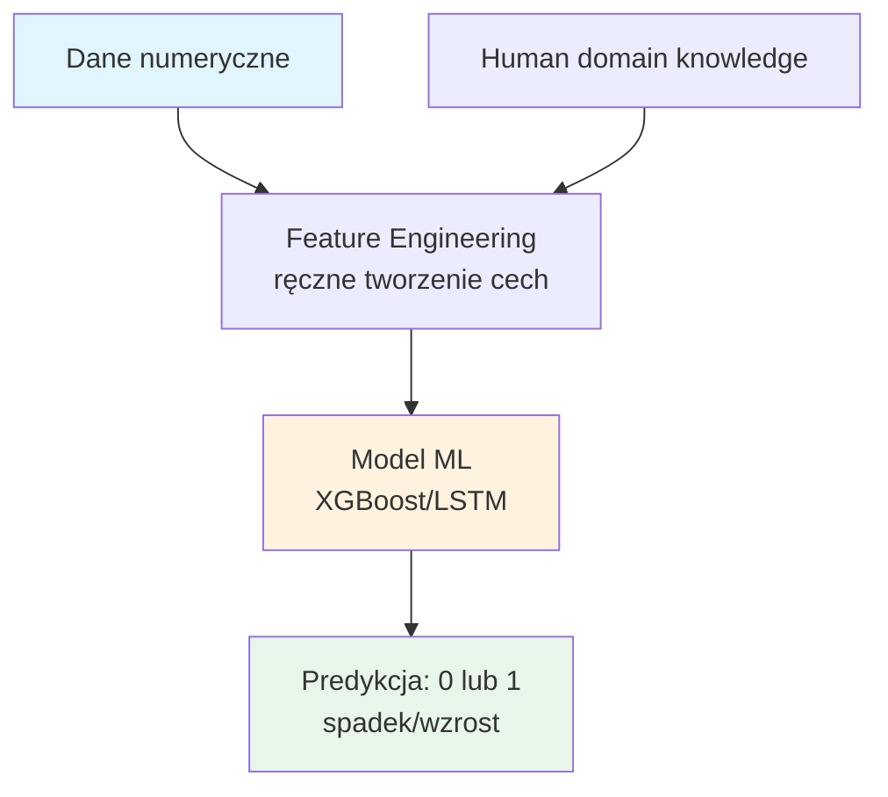
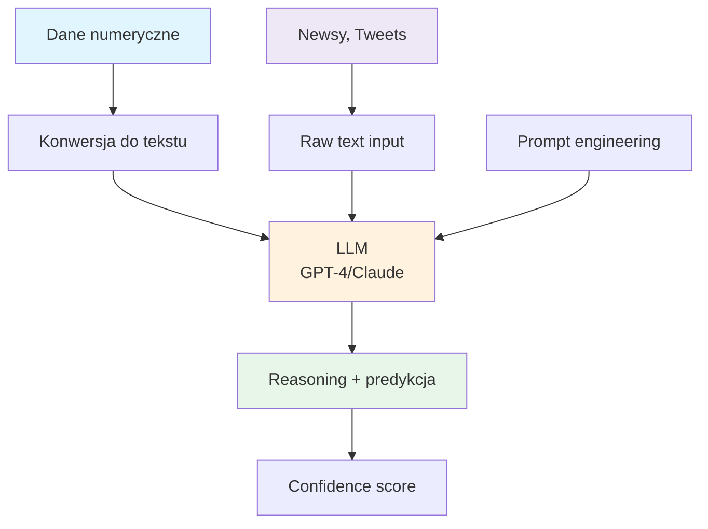
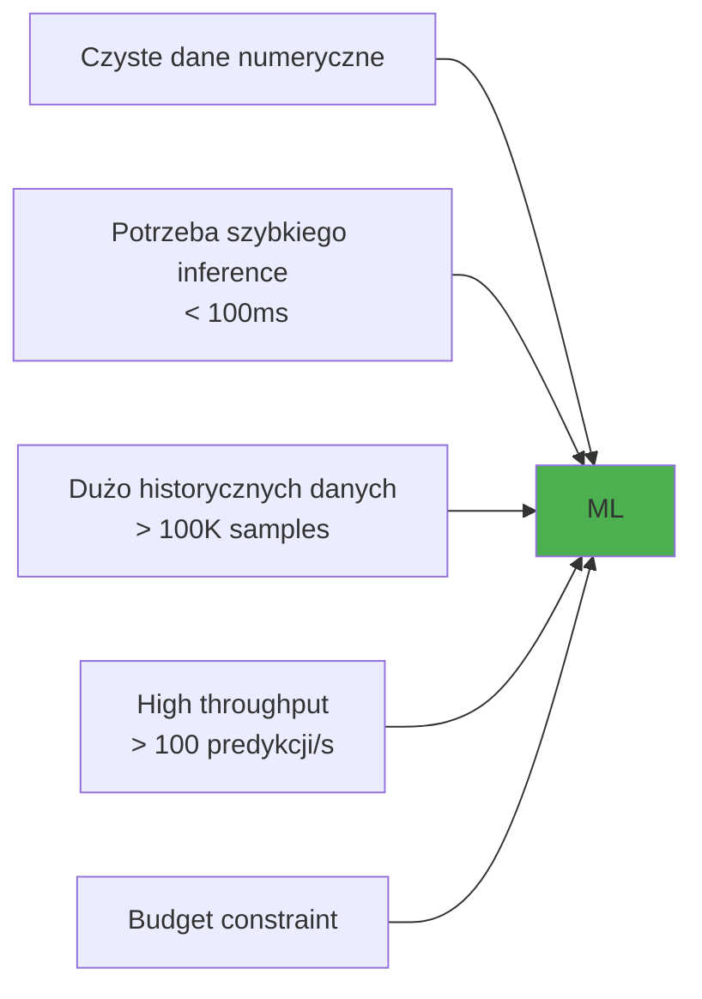
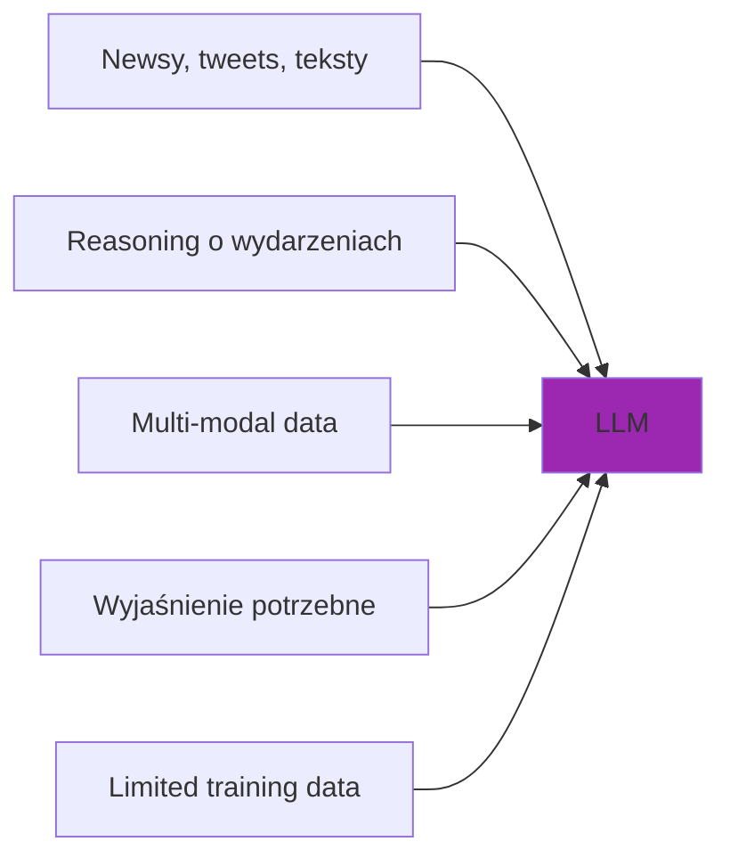
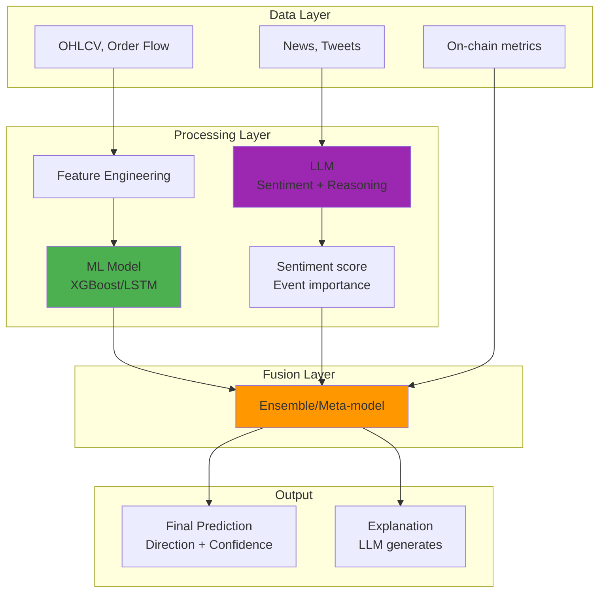
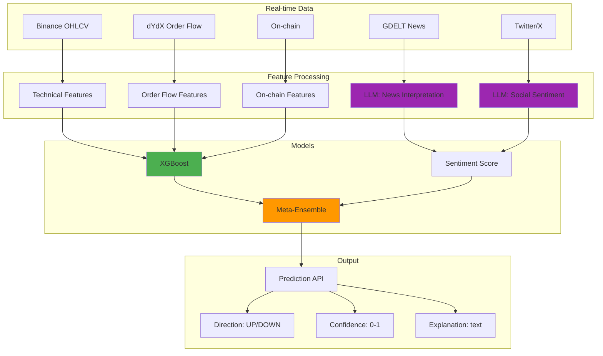

# 🤖 ML vs LLM: Która Technologia dla Predykcji BTC?

## Wprowadzenie

To kluczowe pytanie projektowe: czy używać **tradycyjnego ML** (XGBoost, Random Forest, LSTM) czy **Large Language Models** (GPT-4, Claude, Llama) do predykcji kierunku BTC?

**Spoiler**: Prawdopodobnie najlepsze jest podejście **hybrydowe**.

---

## Porównanie Architektur

### Traditional ML



### LLM Approach



---

## Szczegółowe Porównanie

### 1. Typy danych

| Aspekt | Traditional ML | LLM |
|--------|----------------|-----|
| **Dane numeryczne** | ⭐⭐⭐⭐⭐ Optymalne | ⭐⭐⭐ Wymaga konwersji |
| **Time series** | ⭐⭐⭐⭐⭐ LSTM, Transformers | ⭐⭐⭐ Może, ale nieoptymalne |
| **Text (news, tweets)** | ⭐⭐⭐ Wymaga NLP preprocessing | ⭐⭐⭐⭐⭐ Natywne |
| **Multi-modal** | ⭐⭐ Trudne | ⭐⭐⭐⭐⭐ Natywne (GPT-4V) |
| **Reasoning o wydarzeniach** | ⭐ Niemożliwe | ⭐⭐⭐⭐⭐ Core strength |

### 2. Wymagania

| Aspekt | Traditional ML | LLM |
|--------|----------------|-----|
| **Dane treningowe** | 10K-1M+ samples | Zero-shot lub fine-tuning |
| **Compute training** | Godziny-dni (GPU) | Lub API (no training needed) |
| **Compute inference** | Milisekundy | Sekundy (API latency) |
| **Koszt** | Infrastruktura własna | API: $0.01-$0.10/call |
| **Ekspertiza** | ML Engineer | Prompt Engineer |

### 3. Wydajność

| Aspekt | Traditional ML | LLM |
|--------|----------------|-----|
| **Latency** | ⭐⭐⭐⭐⭐ <10ms | ⭐⭐ 1-5s |
| **Throughput** | ⭐⭐⭐⭐⭐ 1000s/sec | ⭐⭐ 1-10/sec |
| **Accuracy (pure numbers)** | ⭐⭐⭐⭐⭐ | ⭐⭐⭐ |
| **Accuracy (with context)** | ⭐⭐⭐ | ⭐⭐⭐⭐ |
| **Explainability** | ⭐⭐⭐ SHAP, LIME | ⭐⭐⭐⭐⭐ Natural language |

### 4. Zalety i wady

#### Traditional ML

| ✅ Zalety | ❌ Wady |
|-----------|---------|
| Szybki inference | Wymaga dużo danych |
| Precyzyjny na numerics | Ślepy na kontekst |
| Tani w runtime | Feature engineering kosztowne |
| Dobrze rozumiany | Nie rozumie "dlaczego" |
| Deterministyczny | Nie adaptuje się real-time |

#### LLM

| ✅ Zalety | ❌ Wady |
|-----------|---------|
| Rozumie kontekst | Wolny |
| Zero-shot capability | Drogi przy skali |
| Wyjaśnia reasoning | Halucynacje możliwe |
| Multimodal | Niestabilny (temperature) |
| Adaptuje się do news | Wymaga prompt engineering |

---

## Kiedy Używać Czego?

### Use Traditional ML gdy:



**Przykłady:**
- Order flow imbalance → kierunek
- Technical indicators → kierunek
- Price action patterns → kierunek

### Use LLM gdy:



**Przykłady:**
- "Fed ogłosił..." → interpretacja
- Tweet Elona Muska → sentiment
- Geopolityczne wydarzenie → impact assessment
- "Dlaczego predykcja = spadek?" → explanation

---

## Podejście Hybrydowe (Rekomendowane)

### Architektura



### Szczegóły

#### Warstwa 1: ML dla danych numerycznych

```python
# XGBoost dla order flow + price action
ml_features = {
    'order_flow_imbalance': float,
    'return_1h': float,
    'vix': float,
    'funding_rate': float,
    # ... 50+ features
}

ml_prediction = xgb_model.predict(ml_features)  # 0.35 (35% confidence up)
```

#### Warstwa 2: LLM dla kontekstu

```python
# LLM dla interpretacji wydarzeń
llm_prompt = """
Recent news in the last 4 hours:
1. Fed Governor: "Inflation remains sticky" (2h ago)
2. BlackRock: Bitcoin ETF sees $500M inflows (1h ago)
3. China: New crypto mining regulations announced (30min ago)

Current market:
- BTC price: $97,500 (down 2% in 4h)
- VIX: 18 (slightly elevated)
- S&P 500: -0.5%

Question: What is the likely direction of BTC in the next hour?
Provide: direction (up/down), confidence (0-1), reasoning.
"""

llm_response = {
    'direction': 'up',
    'confidence': 0.6,
    'reasoning': 'Despite hawkish Fed, massive ETF inflows suggest institutional demand...'
}
```

#### Warstwa 3: Fusion

```python
# Meta-model łączy ML + LLM
final_prediction = meta_model.predict({
    'ml_score': 0.35,  # slightly bearish
    'llm_score': 0.6,  # bullish
    'llm_confidence': 0.6,
    'has_major_news': True,
    'news_recency_hours': 0.5,
})

# Output: 0.52 (slight bullish), confidence: 0.55
```

### Dlaczego hybrydowe działa najlepiej?

| Scenariusz | ML alone | LLM alone | Hybrid |
|------------|----------|-----------|--------|
| Normal trading | ✅ Good | ⚠️ Overkill | ✅ Good |
| Breaking news | ❌ Blind | ✅ Excellent | ✅ Excellent |
| Technical breakdown | ✅ Good | ⚠️ May miss | ✅ Best |
| Black swan event | ❌ Fails | ✅ Can reason | ✅ Best |

---

## Badania i Benchmarki

### Academic Research

| Paper | Rok | Wynik |
|-------|-----|-------|
| "GPT-4 for Financial Prediction" | 2023 | GPT-4 osiąga 55-58% accuracy na news-based prediction |
| "LLMs for Stock Prediction" | 2024 | Hybrid approach +3-5% vs ML-only |
| "FinGPT" | 2023 | Fine-tuned LLM dla finance: competitive z ML |
| "TimeGPT" | 2023 | LLM dla time series: comparably to traditional methods |

### Industry Evidence

| Firma | Podejście | Wyniki |
|-------|-----------|--------|
| Two Sigma | ML-heavy + NLP | Top hedge fund |
| Renaissance | Pure ML (no LLM) | Best historical performance |
| Citadel | Hybrid | Top tier |
| Retail crypto traders | LLM (ChatGPT) | Anecdotal: mixed |

---

## Rekomendacje dla trends-sniffer

### Faza 1: ML Foundation (Teraz)

```
✅ Zaimplementuj XGBoost/LightGBM na obecnych danych
✅ Dodaj LSTM dla sequential patterns
✅ Target: 54-56% accuracy na 1h prediction
```

### Faza 2: LLM Integration (Następnie)

```
✅ Dodaj LLM dla interpretacji GDELT newsów
✅ Sentiment scoring przez LLM
✅ Event importance rating
```

### Faza 3: Hybrid Ensemble (Docelowo)

```
✅ Meta-model łączący ML + LLM
✅ Dynamic weighting (więcej LLM przy news, więcej ML przy quiet)
✅ Explanation generation
```

### Architektura docelowa



---

## Koszt Porównawczy

### ML-only approach

| Item | Cost/month |
|------|------------|
| Cloud GPU (training) | $50-$200 |
| Inference (CPU) | $20-$50 |
| Data storage | $10-$30 |
| **Total** | **$80-$280** |

### LLM-only approach

| Item | Cost/month |
|------|------------|
| GPT-4 API (10K calls) | $100-$300 |
| Claude API (10K calls) | $80-$200 |
| Infrastructure | $20-$50 |
| **Total** | **$200-$550** |

### Hybrid approach

| Item | Cost/month |
|------|------------|
| ML infrastructure | $50-$100 |
| LLM API (2K calls for news) | $50-$100 |
| Meta-model | $20-$50 |
| **Total** | **$120-$250** |

**Wniosek**: Hybrid może być nawet tańszy niż LLM-only!

---

## Podsumowanie

### Verdict: 🏆 Hybrid Approach

| Podejście | Accuracy | Cost | Latency | Explainability | Recommendation |
|-----------|----------|------|---------|----------------|----------------|
| ML-only | 54-57% | $ | ⚡ | ⚠️ | Good baseline |
| LLM-only | 52-55%* | $$ | 🐢 | ✅ | Not for trading |
| **Hybrid** | **56-60%** | $ | ⚡/🐢 | ✅ | **🏆 Best** |

*LLM-only na pure numerics jest słabszy

### Roadmap

1. **Teraz**: ML na dostępnych danych → baseline accuracy
2. **+1 miesiąc**: Dodać LLM dla GDELT news interpretation
3. **+2 miesiące**: Ensemble z meta-modelem
4. **+3 miesiące**: Continuous improvement, A/B testing

---

## Przykładowy Kod: Hybrid Pipeline

```python
from typing import Dict, Tuple
import xgboost as xgb
from anthropic import Anthropic

class HybridPredictor:
    def __init__(self):
        self.ml_model = xgb.Booster()
        self.ml_model.load_model('xgb_model.json')
        self.llm = Anthropic()
    
    def predict(self, 
                numeric_features: Dict, 
                recent_news: List[str]) -> Tuple[float, str]:
        """
        Hybrid prediction combining ML + LLM.
        
        Returns:
            Tuple of (probability_up, explanation)
        """
        # ML prediction
        ml_proba = self.ml_model.predict(
            xgb.DMatrix([list(numeric_features.values())])
        )[0]
        
        # LLM analysis (tylko gdy są newsy)
        if recent_news:
            llm_analysis = self._get_llm_analysis(
                recent_news, numeric_features
            )
            llm_score = llm_analysis['score']
            explanation = llm_analysis['reasoning']
            
            # Weighted combination
            # Więcej wagi LLM gdy newsy są świeże
            news_weight = 0.4 if len(recent_news) > 3 else 0.2
            final_proba = (1 - news_weight) * ml_proba + news_weight * llm_score
        else:
            final_proba = ml_proba
            explanation = "No significant news. Pure technical analysis."
        
        return final_proba, explanation
    
    def _get_llm_analysis(self, news: List[str], context: Dict) -> Dict:
        prompt = f"""Analyze these recent news for Bitcoin:
{chr(10).join(f'- {n}' for n in news)}

Current market context:
- Price change 1h: {context.get('return_1h', 0):.2%}
- VIX: {context.get('vix', 20)}
- Funding rate: {context.get('funding_rate', 0):.4%}

Predict: Will BTC go UP or DOWN in the next hour?
Return JSON: {{"direction": "up/down", "score": 0.0-1.0, "reasoning": "..."}}
"""
        response = self.llm.messages.create(
            model="claude-sonnet-4-20250514",
            max_tokens=500,
            messages=[{"role": "user", "content": prompt}]
        )
        return parse_llm_response(response.content)
```

---

*Dokument stworzony: 2025-12-24 | Autor: Claude Opus 4.5*

