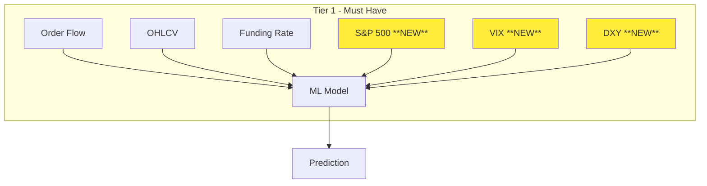
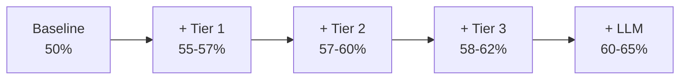
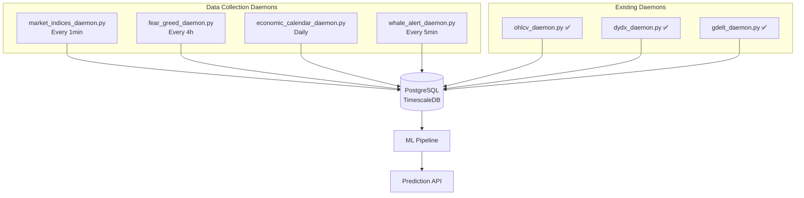

# 📊 Priorytetyzacja Źródeł Danych

## Executive Summary

Po przeanalizowaniu ~50 różnych źródeł danych, poniżej przedstawiam ranking i rekomendacje dla projektu trends-sniffer.

**Cel**: Predykcja kierunku BTC w horyzoncie 1 godziny.

---

## Macierz Priorytetyzacji

### Legenda

| Symbol | Znaczenie |
|--------|-----------|
| ⭐⭐⭐⭐⭐ | Doskonały |
| ⭐⭐⭐⭐ | Bardzo dobry |
| ⭐⭐⭐ | Dobry |
| ⭐⭐ | Średni |
| ⭐ | Słaby |
| ✅ | Już w projekcie |
| 💰 | Wymaga płatnego API |
| 🆓 | Darmowe |

---

## 🥇 Tier 1: Must-Have (Najwyższy priorytet)

Źródła o najwyższym wpływie na 1h predykcję i dobrej dostępności.

| # | Źródło | Status | Potencjał 1h | Dostępność | Koszt | Akcja |
|---|--------|--------|--------------|------------|-------|-------|
| 1 | **Order Flow (dYdX)** | ✅ | ⭐⭐⭐⭐⭐ | ⭐⭐⭐⭐⭐ | 🆓 | Rozbudować features |
| 2 | **OHLCV + Technicals** | ✅ | ⭐⭐⭐⭐ | ⭐⭐⭐⭐⭐ | 🆓 | Więcej indicators |
| 3 | **Funding Rate** | ✅ | ⭐⭐⭐⭐⭐ | ⭐⭐⭐⭐⭐ | 🆓 | Użyć w ML |
| 4 | **S&P 500 / NASDAQ** | ❌ | ⭐⭐⭐⭐⭐ | ⭐⭐⭐⭐⭐ | 🆓 | **DODAĆ** |
| 5 | **VIX** | ❌ | ⭐⭐⭐⭐ | ⭐⭐⭐⭐⭐ | 🆓 | **DODAĆ** |
| 6 | **DXY** | ❌ | ⭐⭐⭐⭐ | ⭐⭐⭐⭐⭐ | 🆓 | **DODAĆ** |



---

## 🥈 Tier 2: High Priority (Wysoki priorytet)

Źródła o znaczącym wpływie, warto dodać w następnej iteracji.

| # | Źródło | Status | Potencjał 1h | Dostępność | Koszt | Akcja |
|---|--------|--------|--------------|------------|-------|-------|
| 7 | **GDELT Sentiment** | ✅ | ⭐⭐⭐⭐ | ⭐⭐⭐⭐⭐ | 🆓 | Rozbudować query |
| 8 | **Fear & Greed Index** | ❌ | ⭐⭐⭐ | ⭐⭐⭐⭐⭐ | 🆓 | **DODAĆ** (proste) |
| 9 | **Exchange Net Flows** | ❌ | ⭐⭐⭐⭐ | ⭐⭐⭐ | 💰 | Rozważyć CryptoQuant |
| 10 | **Whale Movements** | ❌ | ⭐⭐⭐⭐ | ⭐⭐⭐ | 🆓/💰 | Whale Alert Twitter |
| 11 | **Kalendarz (FOMC/CPI)** | ❌ | ⭐⭐⭐⭐ | ⭐⭐⭐⭐⭐ | 🆓 | **DODAĆ** |
| 12 | **Google Trends** | ✅ | ⭐⭐⭐ | ⭐⭐⭐⭐ | 🆓 | Więcej fraz |

---

## 🌟 NEW: Tier 2.5: Spatio-Temporal (Innowacyjne!)

Nowa kategoria: analiza propagacji czynników przez strefy czasowe.

| # | Źródło | Status | Potencjał 1h | Innowacyjność | Koszt | Akcja |
|---|--------|--------|--------------|---------------|-------|-------|
| 13 | **Top Trader Tracking (dYdX)** | ❌ | ⭐⭐⭐⭐⭐ | ⭐⭐⭐⭐⭐ | 🆓 | **DODAĆ** - mamy dane! |
| 14 | **Regional Google Trends** | ❌ | ⭐⭐⭐⭐ | ⭐⭐⭐⭐⭐ | 🆓 | **DODAĆ** |
| 15 | **Asia→EU→US Handoff** | ❌ | ⭐⭐⭐⭐ | ⭐⭐⭐⭐⭐ | 🆓 | **DODAĆ** |
| 16 | **Kimchi Premium** | ❌ | ⭐⭐⭐⭐ | ⭐⭐⭐⭐ | 🆓 | Rozważyć |
| 17 | **Local Weather (SV)** | ❌ | ⭐⭐⭐ | ⭐⭐⭐⭐ | 🆓 | OpenWeather API |
| 18 | **ERCOT Grid Stress** | ❌ | ⭐⭐⭐ | ⭐⭐⭐⭐ | 🆓 | Public API |

---

## 🥉 Tier 3: Medium Priority (Średni priorytet)

Źródła z potencjałem, ale trudniejsze w implementacji lub mniejszy wpływ na 1h.

| # | Źródło | Status | Potencjał 1h | Dostępność | Koszt | Akcja |
|---|--------|--------|--------------|------------|-------|-------|
| 19 | **Stablecoin Flows** | ❌ | ⭐⭐⭐ | ⭐⭐⭐ | 💰 | Opcjonalne |
| 20 | **MVRV/NUPL Momentum** | ❌ | ⭐⭐ | ⭐⭐⭐ | 💰 | Długoterminowy context |
| 21 | **Złoto XAU** | ❌ | ⭐⭐⭐ | ⭐⭐⭐⭐⭐ | 🆓 | Opcjonalne |
| 22 | **10Y Treasury** | ❌ | ⭐⭐ | ⭐⭐⭐⭐⭐ | 🆓 | Opcjonalne |
| 23 | **Reddit Sentiment** | ❌ | ⭐⭐ | ⭐⭐⭐⭐ | 🆓 | Opcjonalne |
| 24 | **Options Open Interest** | ❌ | ⭐⭐⭐ | ⭐⭐⭐ | 🆓/💰 | Deribit API |

---

## 🔬 Tier 4: Experimental / Do Zbadania

Źródła wymagające empirycznej weryfikacji - nie odrzucamy ich z góry!

| # | Źródło | Potencjał 1h | Status badań | Uwagi |
|---|--------|--------------|--------------|-------|
| 25 | Twitter/X | ⭐⭐⭐⭐⭐ | ✅ Udokumentowany | 💰💰💰 BARDZO DROGI |
| 26 | GitHub Activity | 🔬 Do zbadania | ✅ Częściowo | Może wpływać długoterminowo |
| 27 | Global M2 | 🔬 Do zbadania | ✅ Udokumentowany | Miesięczne, ale trend matters |
| 28 | Miner Metrics | 🔬 Do zbadania | ✅ Udokumentowany | Wolne, ale kapitulacja = signal |
| 29 | Lunar Phases | 🔬 Do zbadania | ✅ Peer-reviewed | Dichev & Janes 2003 - 48 rynków! |
| 30 | Sunspots | 🔬 Do zbadania | ✅ Peer-reviewed | Słaby ale istotny statystycznie |
| 31 | Weather (lokalna) | 🔬 Do zbadania | ⚠️ Nowe podejście | W kontekście spatio-temporal! |

**Filozofia**: Wszystko co można zmierzyć, można przetestować. ML nie ma uprzedzeń.

---

## 📋 Plan Implementacji

### Faza 1: Quick Wins (Tydzień 1)

Proste do dodania, darmowe, wysoki impact.

| Task | Czas | Źródło danych | API |
|------|------|---------------|-----|
| Dodać S&P 500, NASDAQ | 2h | Yahoo Finance | yfinance |
| Dodać VIX | 1h | Yahoo Finance | yfinance |
| Dodać DXY | 1h | Yahoo Finance | yfinance |
| Dodać Fear & Greed | 1h | Alternative.me | REST |
| Dodać kalendarz FOMC/CPI | 2h | Static list + API | Manual/API |

**Szacowany czas**: 7 godzin
**Koszt**: $0

### Faza 2: Enhancement (Tydzień 2)

Rozbudowa istniejących źródeł.

| Task | Czas | Opis |
|------|------|------|
| GDELT - więcej query | 4h | Regulatory, geopolitical |
| Google Trends - więcej fraz | 2h | FOMO/FUD frazy |
| Order Flow - nowe features | 3h | Imbalance metrics |
| Technical indicators | 4h | RSI, MACD, BB bands |

**Szacowany czas**: 13 godzin
**Koszt**: $0

### Faza 2.5: Spatio-Temporal (Tydzień 2-3) ⭐ NOWE

Implementacja propagacji przez strefy czasowe.

| Task | Czas | Opis |
|------|------|------|
| Top Trader Identification | 4h | Analiza PnL z dYdX trades |
| Top Trader Real-time Monitor | 6h | Alerting + features |
| Regional Google Trends | 4h | per country/region |
| Handoff Analysis | 4h | Asia→EU→US korelacje |
| Local Weather API | 2h | OpenWeather dla SV, Texas |
| ERCOT Grid Monitor | 2h | Texas grid stress |
| Global Activity Index | 4h | Composite metric |

**Szacowany czas**: 26 godzin
**Koszt**: $0 (OpenWeather free tier)

### Faza 3: Advanced (Tydzień 3-4)

Wymagające więcej pracy lub płatne.

| Task | Czas | Opis | Koszt |
|------|------|------|-------|
| Whale Alert scraper | 4h | Twitter scraping | $0 (risk) |
| CryptoQuant trial | 2h | Exchange flows | $29-99/mo |
| LLM integration | 8h | News interpretation | API costs |
| Options data | 4h | Deribit API | $0 |

**Szacowany czas**: 18 godzin
**Koszt**: $29-200/miesiąc

---

## 📊 ROI Estimate

### Cost-Benefit Analysis

| Faza | Koszt ($) | Czas (h) | Potencjalny accuracy boost |
|------|-----------|----------|---------------------------|
| Faza 1 | $0 | 7h | +3-5% |
| Faza 2 | $0 | 13h | +2-4% |
| Faza 3 | $50-200/mo | 18h | +2-3% |

### Expected Accuracy Progression



**Uwaga**: To są szacunki. Rzeczywiste wyniki zależą od jakości modelu i feature engineering.

---

## 🗂️ Schema bazy danych - Nowe tabele

### 1. market_indices

```sql
CREATE TABLE market_indices (
    timestamp TIMESTAMPTZ NOT NULL,
    symbol VARCHAR(20) NOT NULL,  -- 'SPX', 'VIX', 'DXY', 'NASDAQ'
    value DECIMAL(20, 8) NOT NULL,
    change_1h DECIMAL(10, 6),
    change_24h DECIMAL(10, 6),
    PRIMARY KEY (timestamp, symbol)
);

SELECT create_hypertable('market_indices', 'timestamp');
```

### 2. fear_greed_index

```sql
CREATE TABLE fear_greed_index (
    timestamp TIMESTAMPTZ PRIMARY KEY,
    value INTEGER NOT NULL,  -- 0-100
    classification VARCHAR(20),  -- 'Extreme Fear', 'Fear', etc.
    btc_price DECIMAL(20, 8)
);
```

### 3. economic_calendar

```sql
CREATE TABLE economic_calendar (
    event_date DATE NOT NULL,
    event_time TIME,
    event_name VARCHAR(100) NOT NULL,
    country VARCHAR(3),
    importance VARCHAR(10),  -- 'high', 'medium', 'low'
    actual DECIMAL(20, 8),
    forecast DECIMAL(20, 8),
    previous DECIMAL(20, 8),
    PRIMARY KEY (event_date, event_name)
);
```

### 4. whale_alerts

```sql
CREATE TABLE whale_alerts (
    id SERIAL PRIMARY KEY,
    timestamp TIMESTAMPTZ NOT NULL,
    amount_btc DECIMAL(20, 8),
    amount_usd DECIMAL(20, 2),
    from_type VARCHAR(20),  -- 'exchange', 'unknown', 'wallet'
    to_type VARCHAR(20),
    from_name VARCHAR(50),
    to_name VARCHAR(50),
    transaction_hash VARCHAR(100)
);

SELECT create_hypertable('whale_alerts', 'timestamp');
```

---

## 🔧 Daemon Architecture

### Diagram



---

## 📝 Podsumowanie Decyzji

### ✅ Do zaimplementowania (Tier 1 + 2)

1. **S&P 500, NASDAQ, VIX, DXY** - natychmiast
2. **Fear & Greed Index** - natychmiast
3. **Kalendarz ekonomiczny** - natychmiast
4. **Exchange flows** - z CryptoQuant trial
5. **Whale alerts** - Twitter scraping lub API

### 🤔 Do rozważenia (Tier 3)

6. **LLM integration** - po baseline ML
7. **Options data** - eksploracyjne
8. **On-chain premium** - jeśli budżet

### 🔬 Do zbadania w późniejszych fazach (Tier 4)

9. **Twitter/X** - wysoki potencjał, ale drogi ($5000+/mies)
10. **GitHub Activity** - prawdopodobnie długoterminowy, ale warto przetestować
11. **Sunspots/Lunar** - mają peer-reviewed papers! Warto przetestować jako dodatkowy feature
12. **Pogoda lokalna** - w kontekście spatio-temporal może mieć wpływ (SV upały, Texas grid)

**Podejście**: Nie odrzucamy żadnej hipotezy bez testów. Dodajemy jako low-priority features i mierzymy wpływ.

---

## Następne Kroki

1. [ ] Utworzyć `daemons/market_indices_daemon.py`
2. [ ] Utworzyć `daemons/fear_greed_daemon.py`
3. [ ] Rozszerzyć schemat bazy
4. [ ] Przetestować nowe features w ML
5. [ ] Zmierzyć impact na accuracy

---

*Dokument stworzony: 2025-12-24 | Autor: Claude Opus 4.5*

